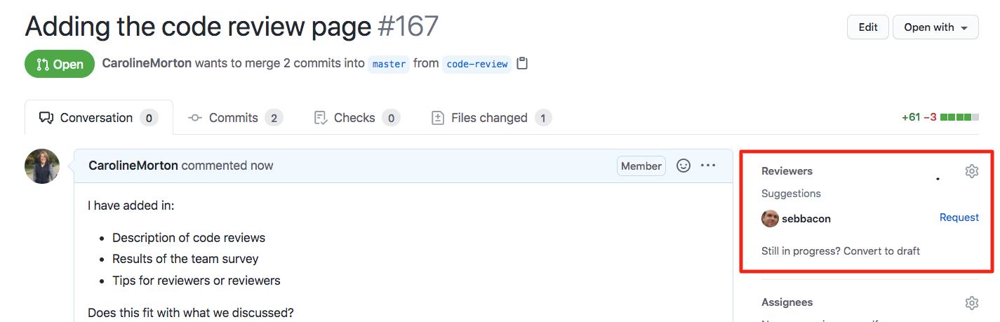
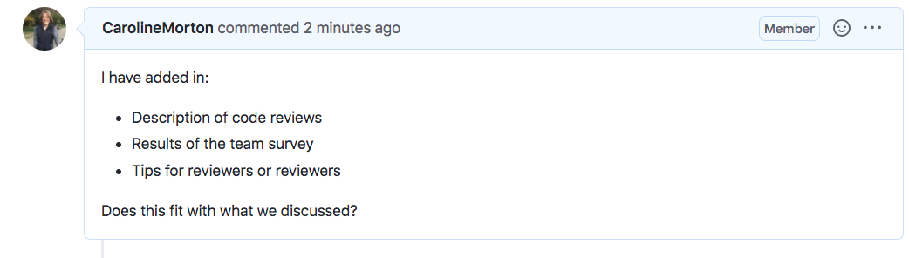
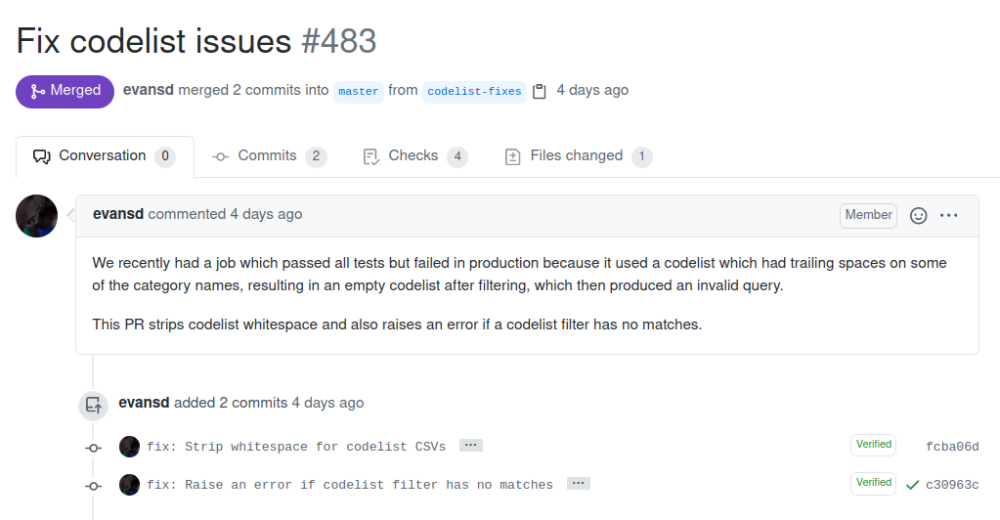

## How to ask for a review

GitHub has a feature built into the workflow that allows easy code review with collaborators, and we would recommend
that you use this tool. GitHub has some [documentation on pull requests and code reviews](https://docs.github.com/en/github/collaborating-with-issues-and-pull-requests/about-pull-request-reviews) which we recommend for background reading.

In this screenshot, the user is making a new pull request. In the top right-hand corner (marked by the
red box), there is a tagging function under Reviewers where you can search or select collaborators to request a code review.
Once you have tagged them and made the pull request, the person will receive a notification to their
email, and the notification will also come up in the pull request section of their GitHub main screen.

!!! note
    If you forget to request a review when creating the pull request, you can request after creating the pull request.

It is strongly encouraged to add some information to the opening message in your pull request to:

* inform the reviewer what your changes are
* act as a reference for anyone else interested in what changes are proposed
* act as a historical record for anyone looking back at why the changes were made

## When to ask for code review?

A good way of conceptualising when to ask for a review is to think about commits and branches. All your work should be done in branches and you should aim to
merge your branches frequently. A user makes a branch to change a feature or adding some new analysis and make several commits to the new branch. When the time comes to merge this back to main, there is a natural inflexion point to do a code review, and each merge should be
accompanied with a code review. If you are in a hurry, and no-one has time to do a more thorough
code review, bear in mind that even a cursory code review is better than no code review.

Merging a new branch should not be your only trigger for a review. If you are stuck or unsure what direction to take, a code review can clarify what path to take. In general, the more frequent the reviews, the better quality the code tends to be.

## How can I write a good pull request?

Some best practice gathered from current users of OpenSAFELY are described below:

- Thinking about the purpose of the review can be helpful as this may vary from review to review.
    - For example, are you looking for a check of the implementation of the logic or methods outlined in the protocol?
      (In which case, linking the protocol can aid this.)
      Or are you looking for a review of how well you document your code and if it is clear and understandable?
      Being transparent will help your reviewer do a better job quicker.
- Good descriptive names for pull requests and commits help the reviewer follow the logic of the code and the changes made (see example of commits below).
- Multiple smaller pull requests are easier than one large to review.
- Code comments and documentations make the logic easier to follow.
- Naming data processing files according to the order they are run, for example, `01_Data_Extraction.py`, `02_Data_Cleaning.py`, etc.
- Allow sufficient time for the review.

### Examples of good commit messages

## How can I be a good reviewer?

### How to perform a code review

Each code review might differ in precisely how it is carried out.
You should use your own best judgement when reviewing to consider *what* should be reviewed and *how*.

!!! note
    Google have some [useful question prompts](https://google.github.io/eng-practices/review/reviewer/looking-for.html) for reviewers to consider. "CL" in that document means "changelist": you can think of "pull request" in place of "changelist".

#### Resources you have available to you to evaluate the changes

* The code itself, including any comments.
  The changes should typically usually be examined by the reviewer.
    * For more complex changes, you may want to review the changes commit-by-commit:
      the Commits tab on the pull request allows you to see view each commit in turn.
    * For very extensive changes, it may not be practical to review all the changes;
      for example, when automated tools change formatting that are not practical to review line-by-line manually.
* Commit messages the author has written.
  These may give extra context for the reasoning behind changes.
* Comments made in any GitHub issue threads associated with the pull request,
  or the pull request itself.
* Running the code to see if the changes do what they claim.
* Checking there are no newly failing tests because of the new changes.
    * In well-organised projects, there should be automated checks on GitHub that run the tests without you needing to run them manually.

#### Some suggestions from current users of OpenSAFELY

- Code review should be a collaborative conversation.
  Don't be afraid to check assumptions or clarify intentions within the review.
  You can add messages to the end of the review request.
- Actionable feedback with suggestions is helpful.
- It can be helpful to highlight the levels of code review comments.
  If something is nice-to-have-but-not-important,
  you can prefix it with `Nit:`.
  For example, "Nit: I think this would be cleared if you didn't use an underscore in this variable name".
- Being clear about what exactly you have reviewed or how thorough the review was.
  For example, being clear that you read through the code but did not run it
  (and therefore may miss running errors in implementation).
  Unit tests should catch that the code is runnable,
  but will not necessarily check it is correct.
- Answer specific questions in the review request.
- Avoiding jabs on coding style.
- Being clear if you do not have time to do a thorough review.

## What actions can we take as a team to encourage code reviews?

- Those in leadership roles should volunteer their time to:
    - do code reviews
    - help find code reviewers
    - help embed the culture of code-reviews widely
- New projects can have a "buddy" who can help to review the code,
  and means they will be familiar with the protocol and code changes from the start.
