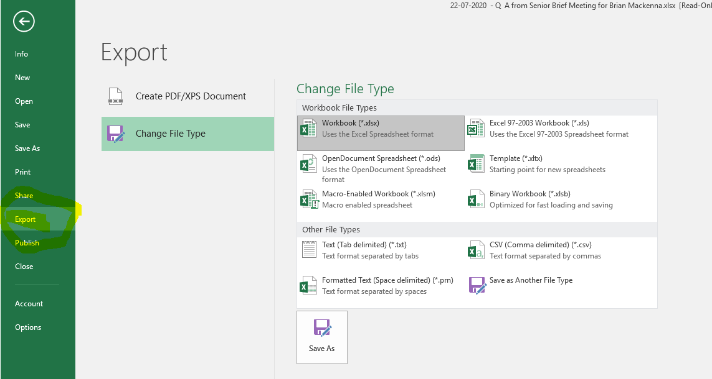

There are two ways to build a codelist using OpenCodelists:

1. [Create a codelist from scratch with the builder](https://www.opencodelists.org/docs/#creating-a-codelist-from-scratch)
2. [Create a codelist from a CSV file](https://www.opencodelists.org/docs/#creating-a-codelist-from-a-csv-file)

The current coding systems available in the OpenCodelists builder are listed below.

| Coding system  |
| ---- |
| [Pseudo BNF](https://www.bennett.ox.ac.uk/blog/2017/04/prescribing-data-bnf-codes/) |
| CTV3 (Read v3)  |
| CTV3 (Read v3) with TPP extensions  |
| [Dictionary of Medicines and Devices (dm+d)](https://www.bennett.ox.ac.uk/blog/2019/08/what-is-the-dm-d-the-nhs-dictionary-of-medicines-and-devices/)  |
| International Classification of Diseases 10 (ICD-10)  |
| SNOMED CT  |

Each codelist must use exactly one of these systems.

OPCS-4 and dm+d codes are not currently supported by the OpenCodelists builder. However, it is possible to [manually upload an existing OPCS-4 or dm+d codelist](https://www.opencodelists.org/docs/#creating-a-codelist-from-a-csv-file).

## Organisations

Codelists on OpenCodelists can be owned by individuals or by organisations. Creating codelists under an organisation means that the codelist is easier to find and reuse. Only codelists created by organisations are included in search results on OpenCodelists.

Any OpenCodelists user with an account can create a codelist. However, in order to create or edit codelists on behalf of an organisation, you must be a member of that organisation.

If you are a member of an OpenCodelists organisation, you will see a [My organisations](https://www.opencodelists.org/organisations/) menu option, where you can view codelists that are owned by your organisations, or that are waiting for review.

To join an organisation, please contact your organisation administrator. Your adminstrator will need your OpenCodelists username or email address in order to add you to the organisation. If you don't know who your organisation administrator is or you don't already have an organisation, please ask your co-pilot.

## Workflow

The general workflow for creating codelists from scratch with the builder is as follows:

1. Search [OpenCodelists](https://www.opencodelists.org) for codelists that meet or nearly meet your requirements and make sure that one doesn't already exist.
1. If you need to build a new codelist [sign up for an account on OpenCodelists](https://www.opencodelists.org/accounts/register/).
1. Create a new issue on the [codelist-development repo](https://github.com/opensafely/codelist-development).
1. Decide your key terms to search for codes. Good source of key words might be a previous codelist, clinicians or experts in the field and
previous research papers.
1. When logged into [OpenCodelists](https://www.opencodelists.org/accounts/login/)  click "my codelists" and then "create new codelist". There is a short video at the [bottom of this page](#build-a-simple-medication-codelist) on how to use the builder to develop a medication codelist. You can create the codelist under your user account or under an organisation. If you make it under your user account, you will be able to move it to an organisation at a later date by [editing the codelist metadata](#editing-existing-codelists).
1. Add/remove terms to your codelists to end up with a list.
1. Save the list as a draft.
1. Clicking "Save changes" makes the codelist available on <https://www.opencodelists.org> as a draft. Share this link to the GitHub issue.
1. Discuss as a group in the issue your decisions, and the reason for including or excluding different codes. Finalise a list
as a group (i.e. at least 2). Detailed reasons are helpful in this issue for referencing in the future.
1. Once agreed, click "Save for review" and obtain sign-off.
1. Summarise your discussion and methodology briefly, and add any references (including the
   GitHub issue) and sign offs by [editing the codelist metadata](#editing-existing-codelists).
   When ready, click "Publish version" to publish it.
1. Close the issue on the [codelist-development repo](https://github.com/opensafely/codelist-development).
1. [Import the codelist](#import-the-codelist-for-use-in-your-study-definition) for use in your study definition.

## Create a new issue on the [codelist-development repo](https://github.com/opensafely/codelist-development)

The issue title should start with either:

* \*PATIENT\* -- non-clinical patient information (demographic, social, etc)
* \*CONDITION\* -- specific clinical conditions / disorders / findings / symptoms
* \*DISEASE\* -- specific diseases
* \*MEDICINE\* -- medicines, treatments, prescriptions, interventions
* another codelist classification if relevant.

<!--are these appropriate classifications? disease versus condition is a notoriously poorly-understood distinction.
what about symptoms, disorders, etc. does it matter?-->

The rest of the title should be short and informative.

## Discuss and document and review

Discuss and document each decision clearly and comprehensively in the issue. Explain why codes have been included and
why codes have been excluded. Link to relevant webpages and documents. Upload files. Involve domain experts. Iterate.

## Sign-off

Once a draft codelist has been agreed, we recommend it should be signed-off by at least two different people.
(These can include the person who led on creating the codelist). This should usually include a "data expert" (epidemiological sign-off) and
"disease expert" (clinical sign-off).

## Creating a codelist from a CSV file

* If your codelist is in an Excel spreadsheet, first [export your Spreadsheet to a CSV](#exporting-a-csv-from-a-spreadsheet).
* For codelists in PseudoBNF, CTv3, ICD-10 or SNOMED-CT coding systems, the CSV must have
  no headers, and the first column must contain the codes. Follow the instructions in the OpenCodelists documentation to [create a codelist by uploading the CSV file](https://www.opencodelists.org/docs/#creating-a-codelist-from-a-csv-file).
* For OPCS-4 or dm+d codelists, use the alternative CSV upload process described in the
  [OpenCodelists documentation](https://www.opencodelists.org/docs/#creating-a-codelist-from-a-csv-file). In this case,
  the CSV file must include a column with the heading `code` (or `dmd_id` for dm+d uploads).
  References and sign-offs can be entered during the upload process, or afterwards, by [editing
  the codelist metadata](#editing-existing-codelists).

## Exporting a CSV from a Spreadsheet
* In Excel go to File
* Click Export in the left-hand ribbon menu
* Select Change File Type
* Click CSV (Comma delimited) (\*.csv)

## Close the issue in the repo

Go to the codelist issue in the [codelist repo](https://github.com/opensafely/codelist-development) and close it.
This issue serves as documentation of the choices made that determined the final codelist. The issue can be
re-opened if revisions are required.

## Import the codelist for use in your study definition

Once the codelist is in [OpenCodelists](https://www.opencodelists.org), you can retrieve it for use in
your research repo. Follow the [adding codelists to project instructions](codelist-project.md) if you're not sure how to do this.

## Codelist contributorship

How contributions to codelists are acknowledged -- to be agreed.

## Editing existing codelists

* Go to an existing Codelist page.
* Click Edit metadata.
* Edit the relevant fields
    * Add, remove, or edit the Owner, Description, Methodology, References and SignOffs as needed.
* Click Submit

## Publishing a Codelist Version

* Go to an existing Codelist page.
    * This will show you the latest version for a Codelist.
* If it's a Under Review version there will be a Publish Version button on the left below Create new version.
* If not, it's already published, and the Publish Version button will be disabled.

## Adding a Codelist Version

* Go to an existing Codelist page.
* Click Create new version.

## Build a simple medication codelist

This is a short video showing how to build a pseudoBNF medication codelist. For OpenSAFELY studies you can convert this
to NHS Dictionary of Medicines and Devices codelist which we briefly mention at the end of the video.

Very briefly, we recommend that you build and agree medication codelists using the pseudoBNF coding system and convert this to
dm+d for use in study definitions. You can read more about the uses and differences between pseudoBNF, dm+d and SNOMED CT
on [our blog](https://www.bennett.ox.ac.uk/blog/2022/11/difference-between-bnf-dm-d-and-snomed-ct-codes/).

  <iframe width="1280" height="720" src="https://www.youtube.com/embed/t-A2kWHZ5lA" frameborder="0" allowfullscreen></iframe>

---8<-- 'includes/glossary.md'
