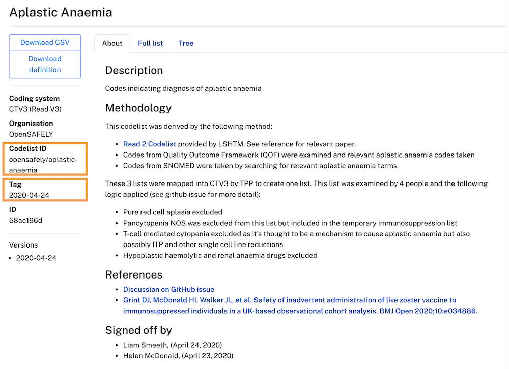

## Adding a codelist

Your example research template doesn't include any codelists but the folder strucure and text files that are needed to include codelists already exist. 
Take a look at the `codelists/codelists.txt` file in the repo, this file is currently empty but you can add one (or more) lines to this file that specify the codelists that you need for your research project. 
The naming convention of the line that you need to add to the `codelists/codelists.txt` file follows this structure: a `<codelist-id> `is followed by `/` and a `<tag>`.
Note that the tag is usually a date (YYYY-MM-DD) but can also be a version number (e.g., v1.2).

```bash
<codelist-id>/<tag>
```

If you want to add a codelist from [OpenCodelists](https://www.opencodelists.org) to your project you can find this information on the page for each of the codelists, see orange boxes in the screenshot below.



You need to add each line into a new line of the `codelists.txt` file. 
The next time you run the command `opensafely codelists update` in your terminal, the codelists you specified earlier will be added to the the `codelists/` subfolder in your project automatically so you don't need to add these files manually to your project.

For example, a `codelists.txt` file of a project may consist of four different lines:

```bash
opensafely/aplastic-anaemia/2020-04-24
opensafely/asplenia/2020-06-02
opensafely/current-asthma/2020-05-06
primis-covid19-vacc-uptake/bmi_stage/v1.2
```

After running the command `opensafely codelists update` the following four .csv files will be added to your project:

```bash
opensafely-aplastic-anaemia.csv
opensafely-asplenia.csv
opensafely-current-asthma.csv
primis-covid19-vacc-uptake-bmi_stage.csv
```

If necessary, during initial development you can even import codelists this way while they are in draft, but ensure they are finalised and updated in your study before running in the real data. 
To use codelists that are in draft you need to add a new line to the `codelists.txt` file using this structure `user/<your_username>/<your-codelist-id>/<tag>`).

## Adding/updating a codelist CSV file
Once you have listed the codelists you need from OpenCodelists in the `codelists.txt` file, you can download the specified files into the `codelist/` folder using the `opensafely` program by running

```bash
opensafely codelists update
```

This command should be re-run everytime a codelist is added or removed from the `codelists.txt` file. Running this command will automatically generate a file called `codelists.json`, which contains a dictionary of codelists files, the URLs they have been downloaded from, download dates, and secure hash algorithms (SHA). The file should not be manually edited; however, you will need to add and commit the change and push to GitHub. If you don't, or a newer version is available than that committed, the automated tests will fail with an error message. Beware that in Windows, if one or more of these codelist files is open then this command won't be able to run; close them first. 

If necessary, you can also import CSVs not via OpenCodelists - just manually copy the CSV files into `codelists/`. However, we would recommend uploading these to OpenCodelists to import them as above. Note, if you are _also_ using some codelists from OpenCodelists, any manually imported codelists should be stored in a `local_codelists` folder so that they are not overwritten in the next step, as manual changes to CSV files will be clobbered the next time the command is run. 

See more on using Codelists in your study definition in [Working with codelists](study-def-codelists.md).

---8<-- 'includes/glossary.md'
