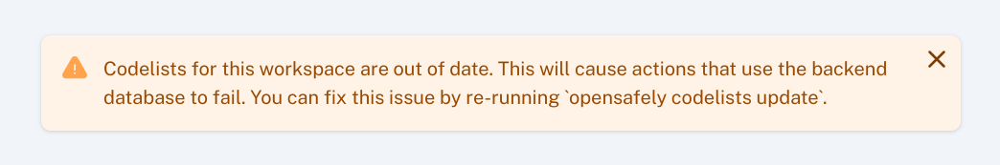

Once your codelists are [imported into your study](codelist-project.md), they are ready to be
used for running jobs on the [jobs site](jobs-site.md).

You may encounter a warning message when you try to run jobs, that looks something like this:

To fix this, you will need to follow the steps to [add a codelist into your study](codelist-project.md#addingupdating-a-codelist-csv-file) again.

Note that this warning is only relevant if the jobs you are running require access to the
backend database. Analysis jobs that use data that has already been extracted in a previous
run do not need to update codelists in order to run successfully.

!!! Info

    [The Dictionary of Medicines and Devices (dm+d)](https://www.bennett.ox.ac.uk/blog/2019/08/what-is-the-dm-d-the-nhs-dictionary-of-medicines-and-devices/)[^1]
    is a dictionary of descriptions and (SNOMED-CT) codes which represent medicines and devices in use across the NHS. The codes representing specific medicines can change, and [require special treatment](#addressing-changing-dmd-codes), described below. As a result,
    dm+d codelists now download with standardised column headings: "code" (the dm+d code), and "term" (the description) in the CSV files. For backwards compatibility, they also
    include a column with the original code column heading (typically "dmd_id") [^2].

### Addressing changing dm+d codes

The dm+d coding system is a particular concern with regards to keeping codelists up to date.
dm+d is updated and released on a weekly basis. Codes for Virtual Medicinal Products (VMPs)[^1]
can change, which means that after a new release of dm+d, a VMP with a changed code will no longer match patients that it did previously.

In order to address this, OpenCodelists maintains a mapping of changed VMP codes. When you run
`opensafely codelists update` to download codelist CSV files into your study repo, dm+d
codelist CSV files will include the codes explicitly specified in the codelist *and* any
previous or subsequent changes to those codes.

If a new release of dm+d introduces new VMP mappings that affect codes in your codelists, you
may be prompted (by the opensafely command line tool, automated tests in GitHub, or the jobs site) to re-run `opensafely codelists update`, commit the changes and push them to GitHub
before you can run jobs.

## "out-of-date" codelists

Codelists for any coding system may go "out-of-date".  All coding systems change (with the exception of CTv3, which is no longer updated), and new releases are published which may add new codes or retire codes.

A codelist version on OpenCodelists is associated with a specific release of a coding system,
and, once under review or published, it cannot change. This means that, for the most part, any
codelist that has been specified in `codelists.txt` with a `version-id` and downloaded into
a study repo will not need to be updated again.

!!! warning

    This does not mean that the codelist is up-to-date with the most recent release of a coding
    system. It only means that the version downloaded in the study has not changed on
    OpenCodelists.

You may need to create new versions of codelists in order to update them to a more recent
coding system release. To do this, go to an existing Codelist page and click on Create new
version.

[^1]: For further information, refer to our [blog post describing the dm+d coding system](
https://www.bennett.ox.ac.uk/blog/2019/08/what-is-the-dm-d-the-nhs-dictionary-of-medicines-and-devices/).
[^2]: dm+d codelists are often created by converting a PseudoBNF codelist, which results in
specific column headings (including "dmd_code" for the code column). For more details, see our
[blog post on the relationship between BNF, dm+d and SNOMED-CT](https://www.bennett.ox.ac.uk/blog/2022/11/difference-between-bnf-dm-d-and-snomed-ct-codes/)
