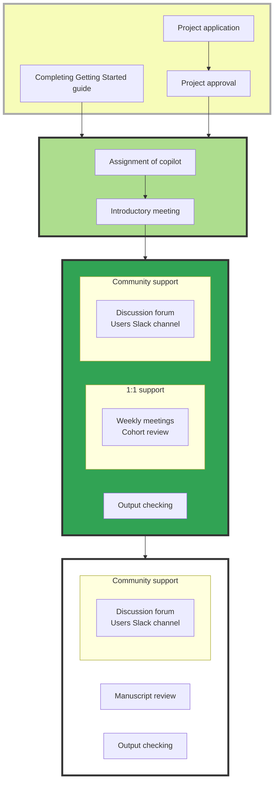
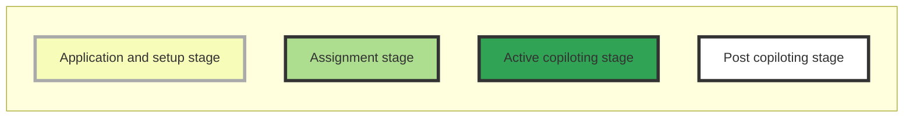

# OpenSAFELY copiloting service

## What is the OpenSAFELY copiloting service?

All new users of the OpenSAFELY platform are offered access to our copilot service, which pairs the new user (the "pilot") with an experienced OpenSAFELY researcher (the "copilot") to help with the onboarding process. The objective of this service is to help new users get up and running with OpenSAFELY as quickly as possible and aims to facilitate the generation of analytical outputs from real data within a four week period.

The service includes:
- dedicated 1:1 support with cohort extraction via the OpenSAFELY plaform
- community support via GitHub forums and the #opensafely-users Slack channel
- GitHub introduction and coaching
- output checking service 
- manuscript review
- opportunities to present at quarterly OpenSAFELY User Group meetings

## What are the aims of the OpenSAFELY copiloting service?

By the end of the 4 week period, pilots should:

* Be familiar with the core OpenSAFELY concepts (study definition, actions, running locally vs running in job server, requesting output release, codelists)
* Be able to run the OpenSAFELY environment locally and on the job server
* Have generated the study population for their project
* Run analysis scripts on the population
* Generated outputs ready for review

## How does the copiloting service run?

The diagram below illustrates how a project will progress through the copiloting service. More information about each stage is provided in subsections below.

### Project application and software setup

All projects need to have sought and been granted [IG approval](https://www.opensafely.org/policies-for-researchers/) before a copilot can be requested and assigned. We also ask that new users complete the OpenSAFEELY [Getting Started guide](https://docs.opensafely.org/en/latest/getting-started/) to ensure that the necessary software can be installed and run on your computer.

In our experience, copiloting is most successful when the pilot has some experience with coding (e.g., Python, R or Stata), is familiar with collaborative code development via GitHub and is able to commit four weeks or more to their project.

If you are unsure whether copiloting will work for your project, contact `team@opensafely.org` or use the [contact form on our website](https://www.opensafely.org/contact/).

### Assignment of copilot

Once a project has been approved, it will be matched to one of our internal OpenSAFELY researchers, in terms of the experience and knowledge required for the project. The pilot and copilot will have an introductory meeting in which the copilot will provide further details about the copiloting service and the pilot can provide further details about the research project. At this meeting, both parties will agree when the dedicated 1:1 support period will begin.

The slides that we use for these meetings are available [here](https://docs.google.com/presentation/d/16wAFjIPRLef3UbibSRO1R7E2GXmRohPT/edit?usp=share_link). Some of our copilots also run through a version of these slides in [this video on our Youtube channel](https://youtu.be/3BNmoV7aHwA).

### Active copiloting stage (four weeks)

The four week period of copiloting is intended to provide a supportive, encouraging environment in which a new user can become familiar with how to build and run a research study using the OpenSAFELY platform. In our experience, pilots get the most out of the service if they are able to focus exclusively on the project for the four week period.

Copilots will provide up to five days over the four weeks to support the development of the research study. This support includes:

- explaining and demonstrating how OpenSAFELY works
- weekly meetings to scope out achievable weekly objectives and tackle problems
- support with the construction of the required patient cohort
- support with the identification of clinical/demographic variables of interest
- support with identifying or building codelists on [opencodelists.org](https://www.opencodelists.org/)
- help with navigating [docs.opensafely.org](https://docs.opensafely.org) to find necessary documentation and policies
- help with navigating [github.com/opensafely](https://github.com/opensafely) to find helpful examples
- advice on implementing quality assurance steps
- advice on disclosure control and redaction as carried out by our output checking service
- help with troubleshooting errors when running the study locally or on the server
- coaching, advice and feedback with regards to best practice on GitHub
- communicating with the OpenSAFELY tech team on the pilot's behalf with regards to platform development

Please note that copilots will not perform code review of any analysis scripts or review any codelists that are developed. This is because this expertise lies with the pilot and their wider research team; pilots will be advised to identify someone within their own organisation who is willing to review this component of the project.

## What happens after the copiloting period is over (the 'post copiloting stage')? 

It is not expected that the research project will be complete at the end of the active copiloting period, rather that the pilot will have acquired the relevant experience to complete the project independently. All community resources (the [discussion forum](https://github.com/opensafely/documentation/discussions) and the `#opensafely-users` Slack channel) will remain accessible to the pilots but regular, dedicated 1:1 support for study implementation will end. The copilot will remain involved in the project over the long term in terms of output checking and manuscript review. 

As with all OpenSAFELY projects, once a copiloted project is finished, published or it reaches its 1 year anniversary, the associated GitHub repository (and Jobserver outputs) need to be made public. See [https://docs.opensafely.org/publishing-repo/](https://docs.opensafely.org/publishing-repo/) for more information.

## What is our authorship policy?

Authorship should be discussed at the introductory meeting of any copiloted project. Our specific policy regarding authorship for copiloted projects is outlined below:

- The OpenSAFELY copilot(s) for the project should always be offered authorship. Sometimes, if the copilot has needed to do a substantial amount of work to deliver a data analysis project for or with a collaborator organisation, it may be appropriate for the copilot to be offered joint first authorship (but not first). Appropriateness of joint first-authorship should be discussed with your co-pilot based on the extent of their contribution to your project.
- A core team of people who contribute to the running of the OpenSAFELY platform which facilitate every study that is completed should also be offered authorship. This includes people who contribute to the platform, code, data acquisition, data curation and management, and design of OpenSAFELY.
- In some circumstances (for example multiple consortia outputs across a diverse range of different datasets in a diverse range of different platforms with an extremely large number of contributors) it might be appropriate for some OpenSAFELY team to be authors, and others making smaller specific contributions to that single output to be listed under the group author name “The OpenSAFELY Collaborative” if the journal permits this in a manner that ensures that the individual names of members of that group author name also appear in Google Scholar and PubMed records (as is common with many journals).
- As with standard authorship guidelines, named authors must be given the opportunity to read and approve the final manuscript before submission. Persons offered authorship should also have the opportunity to decline the offer if preferred.
- A template authorship contribution form containing the named persons who should be offered authorship (and their contributions towards running the platform) can be found [here](https://docs.google.com/spreadsheets/d/1IR9EPswVzR1w224J9owyMjL_-Uao4LMpN8ntKKkE86c/edit).
