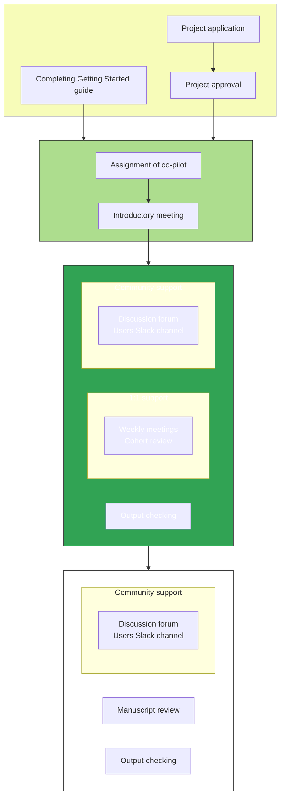

# OpenSAFELY co-piloting service

## What is the OpenSAFELY co-piloting service?

All new users of the OpenSAFELY platform are offered access to our co-pilot service, which pairs the new user (the "pilot") with an experienced OpenSAFELY researcher (the "co-pilot") to help with the onboarding process. The objective of this service is to help new users get up and running with OpenSAFELY as quickly as possible and aims to facilitate the generation of analytical outputs from real data within a four week period.

The service includes five days (over four weeks) of dedicated 1:1 support with cohort extraction via the OpenSAFELY plaform and advise with regards to Github.

Beyond this initial four week period, we also provide:

- community support via GitHub forums and the `#opensafely-users` Slack channel
- output checking service
- manuscript review
- opportunities to present at quarterly OpenSAFELY User Group meetings

## What are the aims of the OpenSAFELY co-piloting service?

By the end of the 4 week period, pilots should:

* Be familiar with the core OpenSAFELY concepts (study definition, actions, running locally vs running in job server, requesting output release, codelists)
* Be able to run the OpenSAFELY environment locally and on the job server
* Have generated the study population for their project
* Run analysis scripts on the population
* Generated outputs ready for review

## How does the co-piloting service run?

The diagram below illustrates how a project will progress through the co-piloting service. More information about each stage is provided in subsections below.

### Project application and software setup

All projects need to have sought and been granted [IG approval](https://www.opensafely.org/policies-for-researchers/) before a co-pilot can be requested and assigned. We also ask that new users complete the OpenSAFEELY [Getting Started guide](https://docs.opensafely.org/en/latest/getting-started/) to ensure that the necessary software can be installed and run on your computer.

In our experience, co-piloting is most successful when the pilot has some experience with coding (e.g., Python, R or Stata), is familiar with collaborative code development via GitHub and is able to commit four weeks or more to their project. However, we have had people with the required motivation and enthusiasm, and an existing adjacent skillset, to get results within four weeks.

If you are unsure whether co-piloting will work for your project, contact `team@opensafely.org` or use the [contact form on our website](https://www.opensafely.org/contact/).

### Assignment of co-pilot

Once a project has been approved, it will be matched to one of our internal OpenSAFELY researchers, in terms of the experience and knowledge required for the project. The pilot and co-pilot will have an introductory meeting in which the co-pilot will provide further details about the co-piloting service and the pilot can provide further details about the research project. At this meeting, both parties will agree when the dedicated 1:1 support period will begin.

The slides that we use for these meetings are available [here](https://docs.google.com/presentation/d/16wAFjIPRLef3UbibSRO1R7E2GXmRohPT/edit?usp=share_link). Some of our co-pilots also run through a version of these slides in [this video on our Youtube channel](https://youtu.be/3BNmoV7aHwA).

### Active co-piloting stage (four weeks)

The four week period of co-piloting is intended to provide a supportive, encouraging environment in which a new user can become familiar with how to build and run a research study using the OpenSAFELY platform. In our experience, pilots get the most out of the service if they are able to focus exclusively on the project for the four week period.

co-pilots will provide up to five days over the four weeks to support the development of the research study. This support includes:

- explaining and demonstrating how OpenSAFELY works
- weekly meetings to scope out achievable weekly objectives and tackle problems
- support with the construction of the required patient cohort
- support with the identification of clinical/demographic variables of interest
- support with identifying or building codelists on [opencodelists.org](https://www.opencodelists.org/)
- help with navigating [the OpenSAFELY documentation](https://docs.opensafely.org) to find necessary documentation and policies
- help with navigating [the OpenSAFELY GitHub repository](https://github.com/opensafely) to find helpful examples
- advice on implementing quality assurance steps
- advice on disclosure control and redaction as carried out by our output checking service
- help with troubleshooting errors when running the study locally or on the server
- coaching, advice and feedback with regards to best practice on GitHub
- communicating with the OpenSAFELY tech team on the pilot's behalf with regards to platform development

Please note that co-pilots will not perform code review of any analysis scripts or review any codelists that are developed. This is because this expertise lies with the pilot and their wider research team; pilots will be advised to identify someone within their own organisation who is willing to review this component of the project.

## What happens after the co-piloting period is over (the 'post co-piloting stage')?

It is not expected that the research project will be complete at the end of the active co-piloting period, rather that the pilot will have acquired the relevant experience to complete the project independently. All community resources (the [discussion forum](https://github.com/opensafely/documentation/discussions) and the `#opensafely-users` Slack channel) will remain accessible to the pilots but regular, dedicated 1:1 support for study implementation will end. The co-pilot will remain involved in the project over the long term in terms of output checking and manuscript review.

All OpenSAFELY outputs require approval from NHS England before they can be disseminated any wider than the pilot's research group. This includes academic manuscripts (pre-printed or peer-reviewed), conference abstracts and presentations, internal reports and masters/PhD theses. Our IG team will handle the NHS England approval process; for more information about how to request NHS England approval and what to include in your publication text please see [this section of our documentation](https://www.opensafely.org/policies-for-researchers/).

## What is our authorship policy?

We encourage all our users who produce traditional academic papers to preprint their work. The vast majority of OpenSAFELY papers have been preprinted on on [medRxiv](https://www.medrxiv.org/), however we are happy for them to be preprinted on other servers. If you typically use other preprint servers, please let us know so that we can assess whether they are appropriate for OpenSAFELY studies.

Authorship should be discussed at the introductory meeting of any co-piloted project. Our specific policy regarding authorship for co-piloted projects is outlined below:

- The OpenSAFELY co-pilot(s) for the project should always be offered authorship. Sometimes, if the co-pilot has needed to do a substantial amount of work to deliver a data analysis project for or with a collaborator organisation, it may be appropriate for the co-pilot to be offered joint first authorship (but not first). Appropriateness of joint first-authorship should be discussed with your co-pilot based on the extent of their contribution to your project.
- A core team of people who contribute to the running of the OpenSAFELY platform which facilitate every study that is completed should also be offered authorship. This includes people who contribute to the platform, code, data acquisition, data curation and management, and design of OpenSAFELY.
- In some circumstances (for example multiple consortia outputs across a diverse range of different datasets in a diverse range of different platforms with an extremely large number of contributors) it might be appropriate for some OpenSAFELY team to be authors, and others making smaller specific contributions to that single output to be listed under the group author name “The OpenSAFELY Collaborative” if the journal permits this in a manner that ensures that the individual names of members of that group author name also appear in Google Scholar and PubMed records (as is common with many journals).
- As with standard authorship guidelines, named authors must be given the opportunity to read and approve the final manuscript before submission. Persons offered authorship should also have the opportunity to decline the offer if preferred.
- A template authorship contribution form containing the named persons who should be offered authorship (and their contributions towards running the platform) can be found [here](https://docs.google.com/spreadsheets/d/1-piPlxWtp1RbhQ5l7AGPrE8nLTzDIavPB1MG9bZPBfM/edit?usp=share_link).

## Where can I find out more?

You can read about the experience of one of our previous pilots, Rachel Seeley from PrescQIPP CIC, in [this blog post](https://www.bennett.ox.ac.uk/blog/2023/01/conducting-research-using-opensafely-my-experience-of-the-co-pilot-service/).

You can read more about how external projects are run on our [Policies for Researchers page](https://www.opensafely.org/policies-for-researchers/#acknowledgment-and-data-sharing--publication-policy). Alternatively, send us an email at [team@opensafely.org](mailto:team@opensafely.org) to start a conversation!
