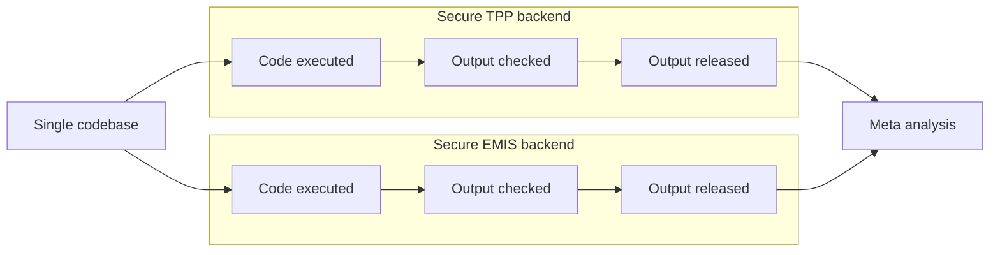

!!! note "What is federation?"

    Federation is the ability to **write research code once**; **run it in multiple locations that contain sensitive patient data**; and **combine summary outputs that do not contain sensitive data**. 
    
    This means raw clinical data never leaves its original, secure location; yet research can still span different databases.

The principle of federation is well-established in academic literature, and has been implemented in a number of different clinical research settings, such as [EMIF](https://doi.org/10.1007/s11023-018-9467-4) and [Personal Health Train](https://doi.org/10.1007/s00439-018-1924-x).

To support federation, we install OpenSAFELY as a data access layer in front of existing patient databases; we call this layer a **backend**. For example, Primary Care data in England is provided by [two large backends described here](dataset-intro.md), with the support of the two largest providers of primary care software in the country: TPP and EMIS.  In this way, researchers have access to safe access the records of nearly 60 million patients in England.

The problem is that backends may present very different environments and databases: for example, TPP provides their data in a Microsoft SQL Server database, and EMIS provides it via their EXA analytic platform.  OpenSAFELY tools hide these differences from researchers, so that the **same piece of code can be run everywhere**. After code is run on a backend, its outcomes are checked for  safety within the same secure perimeter, and finally released so they are **recombined**:



## Example walkthrough of federation

[_Trends and clinical characteristics of COVID-19 vaccine recipients_](https://bjgp.org/content/72/714/e51) is a paper examining factors associated with having a COVID-19 vaccine. 

The researcher wrote the code as a **single codebase**, divided  into small components called *actions* ([described here](actions-intro.md)).  They then  [published it in Github](https://github.com/opensafely/Factors-associated-with-COVID-19-vaccination/)—as all researchers must do, in order to run their code in a backend. 

The [first action in the code](actions-cohortextractor.md) extracts a dataset using a kind of cross-platform code known a [study definition](study-def.md). For example, [this section](https://github.com/opensafely/Factors-associated-with-COVID-19-vaccination/blob/969dbbe4c58e7c7391acf7c97f61fcab307b362e/analysis/study_definition.py#L231-L240) of the study definition defines a variable for the most recent date a patient was recorded as having severe obesity:

```python

  sev_obesity = patients.with_these_clinical_events(
    sev_obesity_codes,
    returning = "date",
    ignore_missing_values = True,
    find_last_match_in_period = True,
    on_or_after = "bmi_stage_date",
    on_or_before = "index_date",
    date_format = "YYYY-MM-DD",
  ),
```


When this code is **executed** in each backend, the OpenSAFELY framework converts the study definition into a format understood by each backend, and retrieves the data.

When the data has been extracted, several more actions which process the data are automatically executed. The final one is a Cox regression, again using [identical code](https://github.com/opensafely/Factors-associated-with-COVID-19-vaccination/blob/master/analysis/R/Scripts/03_model_final.R) in both backends.  Each backend is guaranteed to have [identical environments](actions-scripts.md): this means the researcher can be confident that the version of Python (for example) they used in local development is exactly the same as the version available in the TPP and EMIS backends.

The **outputs are checked** for disclosivity by specialists. When they are validated as safe to release, they are **published** so the researchers can access the output data. You can see the [outputs for the vaccination paper here](https://github.com/opensafely/Factors-associated-with-COVID-19-vaccination/tree/master/released_outputs).

Finally, the researcher combines the model outputs in a **meta-analysis** (in this case, combining model coefficients using inverse-variance-weighting) with a [final script, which you can read here](https://github.com/opensafely/Factors-associated-with-COVID-19-vaccination/blob/master/analysis/R/Scripts/06_metaanalysis.R).

## The future


### Automated dashboard generation
We are already using the same "write once, run everywhere" federation system to drive operational dashboards, such as our [vaccine uptake reports](https://reports.opensafely.org/reports/vaccine-coverage-index/), and our dashboard monitoring the [clinical coding of long Covid](https://reports.opensafely.org/reports/clinical-coding-of-long-covid-in-english-primary-care-a-federated-analysis-of-58-million-patient-rec/).

<figure markdown>
 
 <figcaption>Example chart from the Long Covid dashboard</figcaption>
</figure>

However, the process of publishing dashboards isn't as fast as it could be, mainly because the final step of a federated analysis can only happen following a manual output-checking phase. That's why we're focussing on ways to speed up, or even fully automate some classes of output checking, as part of our [OpenSAFELY Interactive](https://interactive.opensafely.org/) project, a no-coding approach to creating templated dashboards.

### Automated backend selection and combination

At the moment, when a user wants to run code in two backends, they indicate this by requesting code be executed in each one separately. We'd like to automate this: it should be possible for a single request to be sent to all supported backends in one go, and scheduled to be run at regular intervals. When we combine this with automated output releasing, it will be possible to develop powerful dashboards that combine data from every OpenSAFELY backend very quickly. For example, we are working on data curation components that will query every backend for metadata and data quality metrics, and combine them into single reports.

### Automated data linkage

Sometimes, datasets need to be linked at a patient level (for example, when primary care data is linked to hospital data). This unavoidably creates a requirement for moving patient data, which is something we'd like to minimise as far as practical.

When two datasets are linked, the current process needs two dataset controllers to  link the data as safely as possible, using shared pseudonymised patient identifiers, and then for one controller to send the data to the other.

It would be better if data was only linked and transferred to the minimum extent necessary for each research purpose. We would like to add functionality to OpenSAFELY, so that when a single piece of research code is executed, the system itself coordinates with other OpenSAFELY nodes to locate the required data, check the permissions, and extract **only the data required for that research code**.  It will then delete the linked data automatically as soon as it is no longer required. This system would remove several chances for human error, remove slow manual coordination steps, be more publicly auditable, and allow any data controller to easily link their data to any other backend within the OpenSAFELY ecosystem.

## Get in touch!

If you, or a group you know of, are working on federated analytics, we'd love to hear from you at [team@opensafely.org](mailto:team@opensafely.org). Although we've solved a number of the simple fededration problems, there's lots more to do, and we are actively seeking collaborators, particularly in the fields of automated output checking, and automated data linkage.
