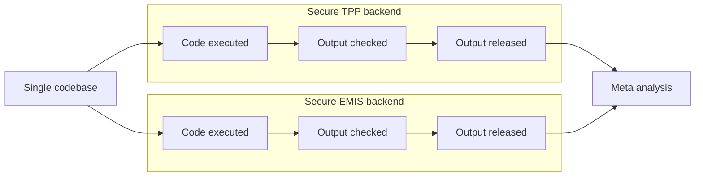
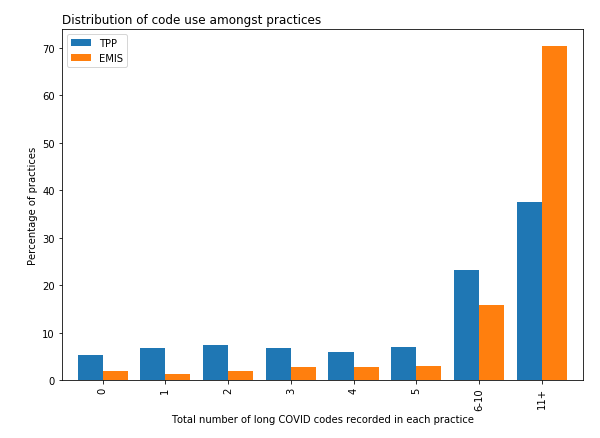

!!! note "What is federation?"

    Federation is the ability to write research code **once**; run it in **multiple locations** that contain sensitive patient data; **retrieve** summary outputs that have been assured not to contain sensitive data; and **combine** these outputs. 
    
    This means raw clinical data never leaves its original (and secure) location, even when research spans different databases.

The principle of federation is well-established in academic literature, and has been implemented in a number of different clinical research settings, such as [EMIF](https://doi.org/10.1007/s11023-018-9467-4) and [Personal Health Train](https://doi.org/10.1007/s00439-018-1924-x).

OpenSAFELY was designed for federation from the start. It is installed as a data access layer in front of multiple existing patient databases; we call an installation a **backend**. For example, Primary Care data in England is provided by [two backends described here](dataset-intro.md), with the support of the two largest providers of primary care software in the country: TPP and EMIS.  In this way, researchers have safe access to the records of nearly 60 million patients in England.

One problem OpenSAFELY solves is that backends may present very different environments and databases: for example, TPP provides their data in a _Microsoft SQL Server_ database, and EMIS provides it via their _EXA_ analytic platform.  OpenSAFELY tools hide these differences from researchers, so that their code can be run **everywhere**. After code is run on a backend, its outcomes are carefully checked for safety within the same secure perimeter, and finally released so that they can be **recombined**:



## Example walkthrough of federation

[_Trends and clinical characteristics of COVID-19 vaccine recipients_](https://bjgp.org/content/72/714/e51) (British Journal of General Practice, 2022) examines factors associated with having a COVID-19 vaccine. 

The researcher wrote the code as a **single codebase**, divided  into small, cross-backend components called *actions*.  

The first action they wrote extracts a dataset using a [study definition](study-def.md)—a uniform way of extracting variables from very different databases.  For example, this section of the study definition creates a variable that indicates when a patient was most recently recorded as having severe obesity:

```python

  sev_obesity = patients.with_these_clinical_events(
    sev_obesity_codes,
    returning = "date",
    ignore_missing_values = True,
    find_last_match_in_period = True,
    on_or_after = "bmi_stage_date",
    on_or_before = "index_date",
    date_format = "YYYY-MM-DD",
  ),
```


The research tested the code with the version of OpenSAFELY installed on their own computer, and then published their code in Github. You can [view the above code extract in context here](https://github.com/opensafely/Factors-associated-with-COVID-19-vaccination/blob/969dbbe4c58e7c7391acf7c97f61fcab307b362e/analysis/study_definition.py#L231-L240). 

They then used the OpenSAFELY control panel to request that their code run in both backends.   The OpenSAFELY framework converted the study definition to a format understood by each backend's database, and retrieved the data, making it available for remotely triggered, hands-free processing within the secure backend environment.

Once the data was extracted, the framework automatically executed several more actions which processed it further. The final action was a Cox regression, using (as always) s[identical code](https://github.com/opensafely/Factors-associated-with-COVID-19-vaccination/blob/master/analysis/R/Scripts/03_model_final.R) in both backends.  The researcher could be confident that the same code would run successfully in every backend, because they are guaranteed to have [identical environments](actions-scripts.md). In this case, they knew the version of R that they used in local development would be exactly the same as the version available in the TPP and EMIS backends.

The **outputs were checked** for disclosivity by privacy specialists. When the results of the regression models were validated as safe to release, they were  **released** from the secure backend for direct access by the researcher. You can see the [TPP and EMIS outputs for the vaccination paper here](https://github.com/opensafely/Factors-associated-with-COVID-19-vaccination/tree/master/released_outputs).

Finally, the researcher combined the model outputs from both backends in a **meta-analysis**  with a [final script, which you can read here](https://github.com/opensafely/Factors-associated-with-COVID-19-vaccination/blob/master/analysis/R/Scripts/06_metaanalysis.R).  In this case, they combined model coefficients using inverse-variance-weighting.

## The future


### Automated dashboard generation
We are already using the same "write once, run everywhere" federation system to drive operational dashboards, such as our [vaccine uptake reports](https://reports.opensafely.org/reports/vaccine-coverage-index/), and our dashboard which monitors the [clinical coding of long Covid](https://reports.opensafely.org/reports/clinical-coding-of-long-covid-in-english-primary-care-a-federated-analysis-of-58-million-patient-rec/).

<figure markdown>
 
 <figcaption>Example chart from the Long Covid dashboard</figcaption>
</figure>

However, the process of publishing dashboards isn't as fast as it could be, mainly because the final step of a federated analysis can only happen following a relatively slow, manual output-checking phase. That's why we're focussing on ways to speed up (or even fully automate) some classes of output checking, as part of our [OpenSAFELY Interactive](https://interactive.opensafely.org/) project, a no-coding approach to creating templated dashboards.  

However, fully automating output releasing is something we don't undertake lightly—there are many risks here, which is why we still maintain humans in the loop at every stage, until we're completely confident we have correctly classified the types of analysis and methods that are safe to use for automatic release.

### Automated backend selection and combination

At the moment, when a user wants to run code in two backends, they request via the OpenSAFELY dashboard that code be executed in each one separately. We'd like to automate this: it should be possible for a single request to be sent to all supported backends in one go, and scheduled to be run at regular intervals. If we combine this with automated output releasing, it will be possible to develop powerful dashboards that combine data from every OpenSAFELY backend very quickly. For example, we are working on data curation components that will query every backend for metadata and data quality metrics, and combine them into a single report.

### Automated data linkage

Often, datasets need to be linked at a patient level (for example, when primary care data is linked to hospital data). This unavoidably creates a requirement for moving patient data, which is something we'd like to minimise as far as practical.

When two datasets are linked, the current process needs two organisations to link their data as safely as possible, using shared pseudonymised patient identifiers, and then for one organisation to send the data to the other. At the moment, we host linked data in the backend where the largest quantity of sensitive data lives, on the principle of moving the smallest amount of potentially-disclosive data possible.

It would be better if data were linked and transferred only to the minimum extent necessary for each research purpose. We plan to add functionality to OpenSAFELY so that when a single piece of research code is executed, the system itself coordinates with other OpenSAFELY nodes to locate the required data; check the permissions; and extract **only the data required for that research code**.  It would automatically delete any linked data, as soon as it is no longer required. This system would remove several chances for human error, remove slow manual coordination steps, be more publicly auditable, and allow any data controller to easily link their data to any other backend within the OpenSAFELY ecosystem.

## Get in touch!

If you, or a group you know of, are working on federated analytics, we'd love to hear from you at [team@opensafely.org](mailto:team@opensafely.org). Although we've solved a number of the simple fededration problems, there's lots more to do, and we are actively seeking collaborators, particularly in the fields of automated output checking, and automated data linkage.
