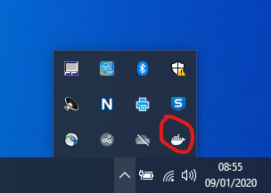
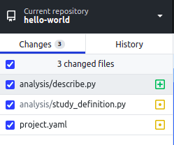
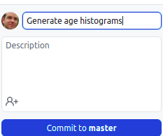
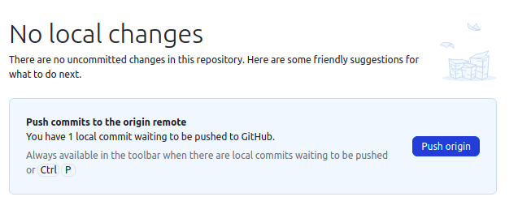
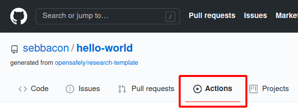
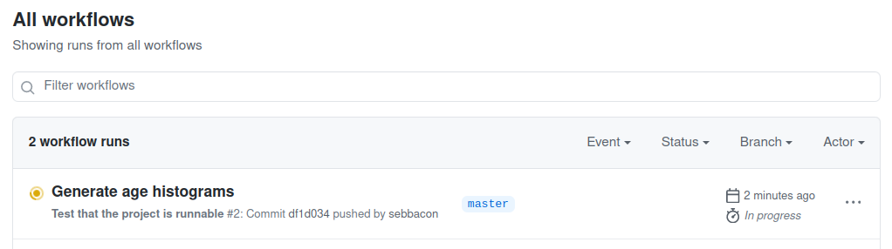

This tutorial will walk you through the minimum steps needed to run an
OpenSAFELY-compliant study against "dummy" (randomly-generated) patient data.
We ask all potential collaborators to successfully complete this tutorial,
before applying to run their project against real data.

This is a first draft of the tutorial, and may have errors or omissions.
Please don't be afraid to ask questions in our [Q&A
forum](https://github.com/opensafely/documentation/discussions)!

!!! note "Windows-only!"
    This version of the tutorial is aimed at Windows users.
    Mac users should be able to follow along as well, with a few
    hopefully-obvious alterations; see also the [macOS Install Guide](install-macos.md)!


## Motivation

OpenSAFELY is designed to allow you to do all of your analytic work on your own
computer, without ever having to access the real, sensitive, patient-level data.

To use the OpenSAFELY framework effectively, you need to:

*  install a few pieces of software; and
*  understand a few concepts which might be new to you

Some of the software you'll install is so you can execute code on your computer
in **exactly the same way** it is run in the secure environment: even a slight
mismatch in the versions of the software could cause bugs and delays.

OpenSAFELY is also designed to encourage analysts to adopt best-practice
software development processes, like using the `git` for version control.  If
you're new to these concepts, there may be quite a lot to learn, and you'll need
to use further software to work with them. The investment will be worthwhile:
you'll find your software quality and efficiency will benefit hugely.

This tutorial is, therefore, a very fast tour through all the **essential**
components required to get up and running.  When you've finished, you'll have
all the basics in place to continue your learning.

## 1. Install the required software

To develop an OpenSAFELY study on your own computer, you will need to install a
few things. Most important is the `opensafely` tool; to install this, you must
(currently) first install the Python programming language.

### Install Python and **opensafely**
1. [Download and run the Anaconda Python
   installer](https://docs.anaconda.com/anaconda/install/windows/).
2. When you've done, to verify your installation, open Anaconda Prompt by
   clicking Start, search, or selecting Anaconda Prompt (or Anaconda Powershell)
   from the menu. 
3. To install the OpenSAFELY command line tool, you first need to install a tool
   called `pip`.  Do this by typing `conda install pip` and pressing ++enter++.
4. Now you can install the command line tool, by typing `pip install opensafely`, and
   pressing ++enter++
5. You should see some output. To check this has installed successfully, type
   `opensafely --help` and press ++enter++.
6. This should show help text on how to use the `opensafely` command.

### Install Docker

!!! note "Windows alert"
    On Windows, installing Docker is usually
    straightforward, but can sometimes be complicated, depending on your exact
    version and configure of Windows. If you run into problems, our more
    [detailed installation notes](install-docker.md) may help.


1. If you are using Windows 10 Pro, Enterprise or Education, you should [follow
   these instructions](https://docs.docker.com/docker-for-windows/install/).
   Otherwise, follow the instructions for [installing on Windows
   Home](https://docs.docker.com/docker-for-windows/install-windows-home/).
   Unfortunately, we've had reports that installing in Windows Home can be very
   challenging. Please let us know if you can help us improve the documentation
   here.
2. Starting Docker can take a while &mdash; up to 5 minutes. While it's doing
   so, an animation runs in the notification area:<br>
   
3. When Docker has finished starting up, share your hard drive with Docker:
   click system tray docker icon; select "settings"; select "shared drives".
4. Test Docker and opensafely work together. Open an Anaconda Prompt, and run
   `opensafely pull cohortextractor`. This will pull down the OpenSAFELY
   cohortextractor images, which can be used to run actions in your study.  The
   first time you run it, this may take a little time, depending on your
   network connection. It is downloading a reproducible environment identical
   to that installed in the OpenSAFELY secure environment.

### Set up GitHub and GitHub Desktop

To use OpenSAFELY, you must have a GitHub account. GitHub is a widely-used
website for storing and collaborating on software, using the version control
software `git`. GitHub is where your open, reproducible research will be
published.

The quickest way to get started is to [install GitHub
Desktop](https://desktop.github.com/). The installation process will also walk
you through the process of creating an account, if you don't already have one.

## 2. Set up your first study

### Create a new repository in GitHub

1. Go to the [GitHub website](https://github.com), and ensure you're logged in.
   You'll be able to tell by looking for your profile at the top right of the
   page.
2. Visit our [research template
   repository](https://github.com/opensafely/research-template)
3. Above the file list, click **Use this template**
   
4. Use the **Owner** drop-down menu, and select the account you want to own the
   repository (typically under your own account)
   
5. Type a name for your repository, and an optional description.
   
6. Choose a repository visibility.  This would usually be "Public".
   
7. Click **Create repository from template**

### Clone it to your computer

Now you'll want to get a copy of that code on your computer, in order to start developing your own study.

1. Look above the list of files in your new repo for a **Code** button. 
2. Click **Open with GitHub Desktop** to clone and open the repository with
   GitHub Desktop. 
3. Click **Choose...** and, using Windows Explorer, navigate to a local path
   where you want to clone the repository.
   
4. Click **Clone**  

### Test the blank study on your computer

1. Open Anaconda Prompt (or use an already-open one)
2. Change your current directory to the location of your cloned, local path. To
   do this, use the `cd` command. For example, `cd
   C:/Users/me/my-git-repos/hello-world` and press ++enter++.
3. Now you're ready to run your first study. Type `opensafely run run_all` and
   press ++enter++
4. The first time you run this command, it will take a while to download the
   required software. Eventually, you should see output that ends something like
   this:
```shell-session
$ opensafely run run_all
<...several lines of output...>
generate_study_population: Extracting output file: output/input.csv
generate_study_population: Completed successfully
generate_study_population: Cleaning up container and volume

=> generate_study_population
   Completed successfully

   log file: metadata/generate_study_population.log
   outputs:
     output/input.csv  - highly_sensitive
```
The final line tells you a file of (randomly-generated) patient data has been created at
`output/input.csv`, and that it should be considered highly sensitive
data. What you see here reproduces exactly what would happen on a real, secure
server, but with *dummy data* which contains no real patient information. 
Because we haven't modified the template blank study yet, this file is empty &mdash; 
we'll generate more dummy data in the next section.
1. If you run `opensafely run run_all` for a second time, you'll see the command
   does nothing (because there's already a file at `output/input.csv`):
```shell-session
$ opensafely run run_all
=> All actions already completed successfully
   Use -f option to force everything to re-run
```

## 3. Make changes to your study

You've successfully run the code in your study, but at the moment it just creates an empty output
file. Now we'll add some code to do something slightly more interesting.

In order to write code in the OpenSAFELY framework, a code editor will make your
life much easier. If you don't already have one, we recommend you download and
install [Visual Studio Code](https://code.visualstudio.com/download).

### Add an `age` column

1. Start Visual Studio Code, and use the menu to open your research repository
   (**File > Open Folder...**)
2. In the "Explorer" on the left hand side, find and click on the file at
   `analysis/study_definition.py`. This file specifies the population that 
   you'd like to study (dataset rows) and what you need to know about them (dataset columns).
3. Add some text so that the file looks like this (new text highlighted):
```python linenums="1" hl_lines="14 15 16 17 18 19 20"
from cohortextractor import StudyDefinition, patients, codelist, codelist_from_csv


study = StudyDefinition(
    default_expectations={
        "date": {"earliest": "1900-01-01", "latest": "today"},
        "rate": "uniform",
        "incidence": 0.5,
    },
    population=patients.registered_with_one_practice_between(
        "2019-02-01", "2020-02-01"
    ),

    age=patients.age_as_of(
        "2019-09-01",
        return_expectations={
            "rate": "universal",
            "int": {"distribution": "population_ages"},
        },
    ),
)

```
Line 10 means "*I'm interested in all patients who have never changed practice,
between these two dates*"; lines 14-15 "*Give me a column of data corresponding
to the age of each patient on the given date*"; and lines 16-18 "*I expect
every patient to have a value, and the distribution of ages to match that of the
real UK population*"
1. In an Anaconda Prompt, run `opensafely run run_all --force-run-dependencies`. A new file will
   be created in the folder `output/input.csv`. Open that file (using Visual
   Studio Code, or Excel) and you'll see it now contains an age for 1000
   randomly generated patients.

### Add a chart

**Every** study starts with a *study definition* like the one you just edited.
When executed, a study definition generates a CSV of patient data.

A real analysis will have several further steps after this. Each step can be
written in [any of the programming languages supported in
OpenSAFELY](actions-scripts.md). In this tutorial, we're going to draw a
histogram of ages, using four lines of Python.

1. Using Visual Studio Code, create a new file (**File > New File**), and add
   the following:
```python
import pandas as pd

data = pd.read_csv("output/input.csv")

fig = data.age.plot.hist().get_figure()
fig.savefig("output/descriptive.png")
```
This code reads the CSV of patient data, and saves a histogram of ages to a new file.
2. Save this file as `analysis/report.py`
3. In Visual Studio Code, open `project.yaml`. This file describes how each step
   in your analysis should be run. It's in a format called YAML: the way it's
   indented matters, so be careful to copy and paste the following carefully.
4. Add a `describe` action to the file, so the entire file looks like this:
```yaml linenums="1" hl_lines="13 14 15 16 17 18"
version: "3.0"

expectations:
  population_size: 1000

actions:
  generate_study_population:
    run: cohortextractor:latest generate_cohort --study-definition study_definition
    outputs:
      highly_sensitive:
        cohort: output/input.csv

  describe:
    run: python:latest python analysis/report.py
    needs: [generate_study_population]
    outputs:
      moderately_sensitive:
        cohort: output/descriptive.png
```
Line 13 tells the system we want to create a new action called `describe`. Line
14 says how to run the script (using the `python` runner). Line 15 tells the
system that this action depends on the outputs of the
`generate_study_population` being present. Lines 16-18 describe the files that
the action creates. Line 17 says that the items indented below it are
*moderately* sensitive, that is they may be released to the public after a
careful review (and possible redaction). Line 18 says that there's one output
file, which will be found at `output/descriptive.png`.
5. Type `opensafely run run_all --force-run-dependencies`. This should end by telling you a file
   containing the histogram has been created. Open it, and check it looks right.

## 4. Push your study to github, and watch the automated tests pass

Now that your study does something interesting, you should "*push*" it to GitHub,
where it can be viewed by others. Your repository is automatically configured
with tests to verify the project is runnable, each time you push.

1. Open GitHub Desktop to view your repository. When you make changes to files in
   your text editor and save them locally, you also see the changes in
   GitHub Desktop. To add all changes in all files to a single "*commit*", tick the
   checkbox at the top of the list.<br>
  
2. At the bottom of the list of changes, in the **Summary** field, type a short,
   meaningful description of the changes (this is called the *commit message*).
   Optionally, you can add more information about the change in the
   **Description** field. Press the blue button to make the commit.<br>
  
3. Click **Push origin** to push your local changes to the remote repository on
   GitHub 
4. In a web browser, visit your repository in GitHub. Click on the **Actions**
   tab 
5. You'll see a *Workflow* running with the *commit message* of your last
   commit. The workflow verifies that the command `opensafely run run_all` can
   run successfully. If it's yellow, it's still running. If it's red, it
   has failed. If it's green, it has succeeded. You want it to be green!
   

## 5. Next steps

Congratulations! You've covered all the basics that you need to develop a study
on your own computer, verify that it can run against real data, and publish it
to GitHub.

To write a real study and run it against actual patient data, you will first
need to get permission for your project from NHS England, the data controllers
for OpenSAFELY's data. We are currently developing an online application
process, but for now just drop us an email at
[team@opensafely.org](mailto:team@opensafely.org).

In the mean time, to a look at the rest of our documentation for more
detail on the subjects covered in this tutorial. For example:

* The [full study definition reference](study-def.md) describes all the
  different ways to define new variables in your study definition.
* You'll find more information about the contents of `project.yaml` in the
  [Actions reference](actions-intro.md).
* There is a final step we've not described here: [a
  website](https://jobs.opensafely.org/) called the ["OpenSAFELY Job
  Server"](job-server.md) where you can submit your repository actions to be run
  automatically within the secure EHR vendor environments. Right now you can
  only use this to run real jobs, but we're working on adding the ability to
  test your repository against dummy data.
* You'll be using `git` and GitHub a lot, and it's a critical but complex part
  of the OpenSAFELY ecosystem. If you're not familiar with these concepts, it's
  a good idea to read our [git workflow page](git-workflow.md) and its linked content.


