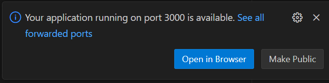
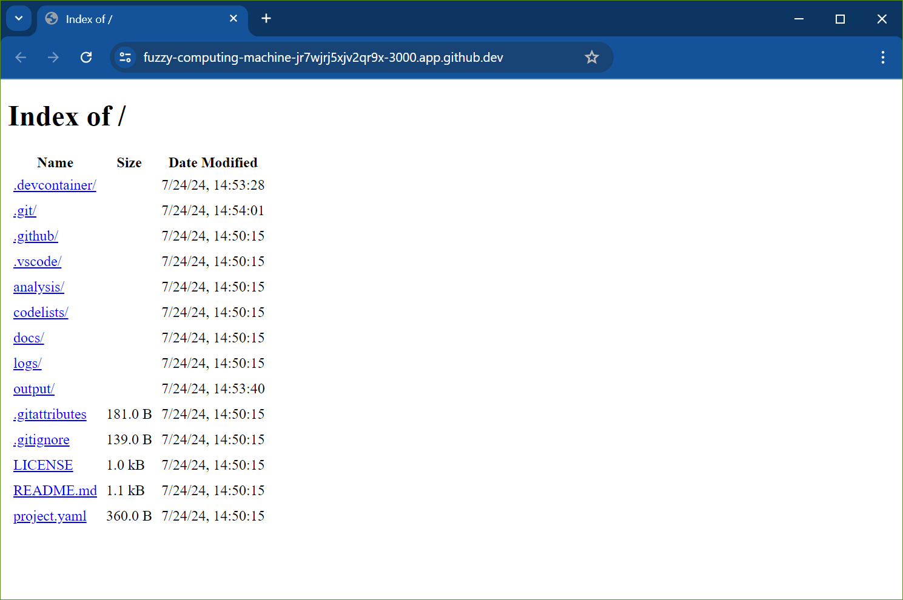
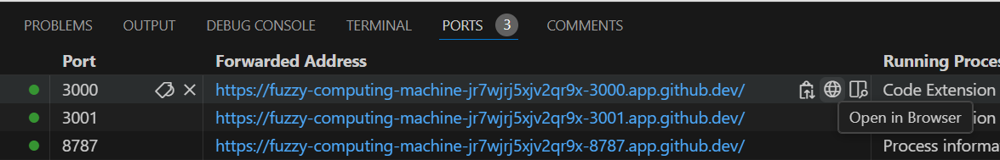

This page describes how to troubleshoot common Codespaces-related issues.

## "This codespace is requesting additional permissions"

On opening a Codespace you will see the following message:

This is perfectly normal and is a result of how we have configured Codespaces to work with Stata.

If you plan to use Stata in your project, then you will need to click the "Authorize and continue" button.
If you do not plan to use Stata, then you may click either button.

## R Session Error

After restarting a stopped Codespace in which you were using RStudio, you may see the following error:

We have not observed any instances of work being lost in conjunction with this error, and so in most cases it can safely be ignored.
Manually terminating your R session before stopping the codespace may prevent this error from appearing.

## Git functionality is missing from RStudio

When you open RStudio within a Codespace, you may find that the Git Menu and Git Tab are missing from the user interface.
This is because, as stated in the [RStudio version control documentation](https://docs.posit.co/ide/user/ide/guide/tools/version-control.html):

> RStudio’s version control features are tied to the use of [Projects](https://docs.posit.co/ide/user/ide/guide/code/projects.html)

In most cases, opening RStudio will create an RStudio project file in your project directory and the Git features will be enabled.

If this does not happen, you may use the New Project Wizard in RStudio to "associate a project with an existing working directory"
as per the instructions in the [RStudio Projects documentation](https://docs.posit.co/ide/user/ide/guide/code/projects.html).

## RStudio's Files tab is not showing the correct directory

Sometimes, when opening RStudio, you may find that the [Files tab](https://docs.posit.co/ide/user/ide/guide/ui/files.html) is not displaying your project directory.

Opening the "More" menu in this tab and selecting "Go To Working Directory" should take you to your project directory.

If this does not work, you will need to navigate to your project directory in the Files tab (`/workspaces/{the name of your github repository}`).
Once you have done this, you may need to select "Set As Working Directory" from the "More" menu of the Files tab to ensure this directory is correctly opened the next time you open RStudio.

## My favourite VS Code extensions are not installed/I'd like to change the settings

You are free to install any VS Code extensions and change any settings you wish within your Codespaces.
However, you will find that any changes you make will not be preserved when you start a new Codespace.

If you wish to make changes that will apply whenever anyone opens your project, then consider using a [Workspace Settings](https://code.visualstudio.com/docs/getstarted/settings#_workspace-settings) file in your project.

If you wish your settings and extensions to be available anywhere you open VS Code (including in Codespaces), then consider using [Settings Sync](https://code.visualstudio.com/docs/editor/settings-sync).

## Previewing HTML files doesn't work

If you are using a codespace to author an HTML file, for example a report, you may wish to see a preview of this. Microsoft's [Live Preview](https://marketplace.visualstudio.com/items?itemName=ms-vscode.live-server) VS Code extension is frequently used for this purpose.
However, if you try to use this extension in a codespace, you might see error messages such as: "This content is blocked. Contact the site owner to fix the issue…" or see that the preview window appears blank.
This is a [currently known issue](https://github.com/microsoft/vscode-livepreview/issues/111) with the extension.

### Workaround

When you first try to open a preview window via the context menu (right click), you may see a pop-up in the bottom right hand corner of your screeen advising you of a new "application running on port 3000":

Clicking "Open in Browser" should open a new tab where you will see a directory listing of the files in your workspace, and from which you can navigate to your desired html file:

You can also navigate to this window via the "ports" tab in VS Code:

### Alternative extension

There is also an [alternative preview extension](https://marketplace.visualstudio.com/items?itemName=searKing.preview-vscode), which [reportedly](https://stackoverflow.com/questions/74452866/how-preview-a-html-file-github-codespaces/75135098#75135098) is not affected by this issue.
We have not tested this extension and therefore cannot vouch for its functionality or safety.