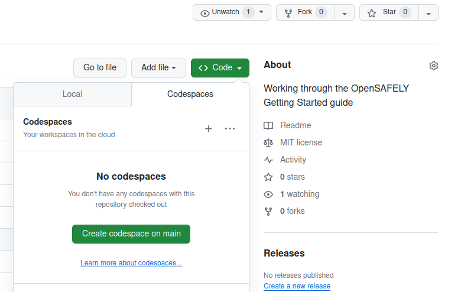
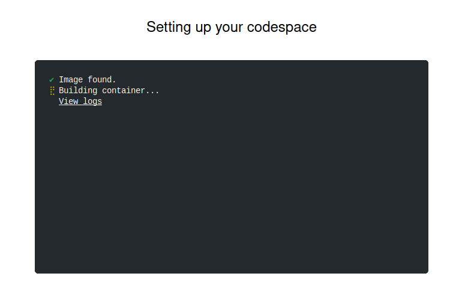

For the repository you just created,
there is a Code button on GitHub.

To open your repository with GitHub Codespaces:

1. Click the Code button.
2. Click the Codespaces tab.
3. Click the "Create codespace on main".
   The screenshot below shows this.



You should then see a "Setting up your codespace" screen:



A GitHub codespace containing the Visual Studio Code editor with a
command-line interface "terminal" should then appear. **This may take
a little bit longer the first time a codespace is started, perhaps
a minute or two.**


The terminal at the bottom-right of the GitHub codespace runs
commands on a computer (virtual machine) provided by GitHub.

The large, upper-right area holds the **main editor**, which is where you will
view and edit files that you are working on. The left **"side bar"**
holds the Explorer when you first start the codespace. There are
other useful menus in this area that can be switched with the icons
to the far left side. Finally, the button at the top-left with three
horizontal lines (`≡`) is the **menu button**, which allows you to
access many more options.

If you find yourself using GitHub regularly for working on research,
we have more information on [working with GitHub codespaces](../../how-to/use-github-codespaces-in-your-project/index.md).

## Running `opensafely`

The `opensafely` software should already be installed if you start
a GitHub codespace for the OpenSAFELY research template.

You can confirm this by typing `opensafely` in the terminal at the
prompt `$` and pressing ++enter++. You should see an output that looks
something like:

```shell-session
$ opensafely
usage: opensafely [-h] [--version] COMMAND ...

optional arguments:
  -h, --help  show this help message and exit
  --version   show program's version number and exit

available commands:

  COMMAND
    help      Show this help message and exit
    run       Run project.yaml actions locally
    codelists
          Commands for interacting with https://codelists.opensafely.org/
    pull      Command for updating the docker images used to run OpenSAFELY studies locally
    upgrade   Upgrade the opensafely cli tool.
```

---

* Previous: [Create a GitHub repository](../create-a-github-repository/index.md)
* Next: [Generate a first dataset](../generate-a-first-dataset/index.md)
