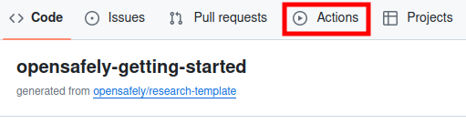
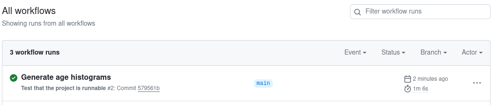

## Running OpenSAFELY

## 5. Make changes to your study

You've successfully run the code in your study, but at the moment it just creates a nearly-empty output
file. Now we'll add some code to do something slightly more interesting.

### Add an `age` column

1. The "Explorer" on the left hand side lists the files and folders in
   your research repository. Find and click on the `dataset_definition.py`
   file inside the `analysis` folder. This file contains a dataset definition,
   specifying the population that you'd like to study (dataset rows)
   and what you need to know about them (dataset columns).
   It is written in [ehrQL](../../../ehrql/index.md).
1. Add some text so that the file looks like this (new text highlighted):
```python linenums="1" hl_lines="15"
from ehrql import create_dataset
from ehrql.tables.tpp import patients, practice_registrations

dataset = create_dataset()

index_date = "2020-03-31"

has_registration = practice_registrations.for_patient_on(
    index_date
).exists_for_patient()

dataset.define_population(has_registration)

dataset.sex = patients.sex
dataset.age = patients.age_on(index_date)
```
Lines 8-12 mean "*I'm interested in all patients who were registered at a practice
on the index date*"; line 14 "*Give me a column of data corresponding
to the sex of each patient*"; and line 15 "*Give me a column of data corresponding
to the age of each patient on the given date*".
1. If you run:

   ```shell-session
   $ opensafely run run_all
   ```

   you'll see the command does nothing (because there's already a file at `output/dataset.csv.gz`):

   ```shell-session
   => All actions already completed successfully
   Use -f option to force everything to re-run
   ```

   We can use the `--force-run-dependencies` (or `-f`) option to force
   the CSV file to be created again.

   ```shell-session
   $ opensafely run run_all --force-run-dependencies
   ```

   A new `dataset.csv.gz` file will be created in the `output` folder.

### Add a chart

**Every** study starts with a *dataset definition* like the one you just edited.
When executed, a dataset definition generates a compressed CSV (`.csv.gz `) of patient data.

A real analysis will have several further steps after this. Each step is defined
in a separate file, and can be written in [any of the programming languages supported in
OpenSAFELY](../../../actions-scripts.md). In this tutorial, we're going to draw a
histogram of ages, using either four lines of Python or just a few more lines of R.

=== "Python"

    1. Right-click on the `analysis` folder in the editor's Explorer and select
       "New file". Type "report.py" as the filename and press ++enter++.
    2. Add the following to `report.py`:.
    ```python
    import pandas as pd

    data = pd.read_csv("output/dataset.csv.gz")

    fig = data.age.plot.hist().get_figure()
    fig.savefig("output/descriptive.png")
    ```

=== "R"

    1. Right-click on the `analysis` folder in the editor's Explorer and select
       "New file". Type "report.R" as the filename and press ++enter++.
    2. Add the following to `report.R`:.
    ```R
    library('tidyverse')

    df_input <- read_csv(
      here::here("output", "dataset.csv.gz"),
      col_types = cols(patient_id = col_integer(),age = col_double())
    )

    plot_age <- ggplot(data=df_input, aes(df_input$age)) + geom_histogram()

    ggsave(
      plot= plot_age,
      filename="descriptive.png", path=here::here("output"),
    )
    ```


This code reads the CSV of patient data, and saves a histogram of ages to a new file.

<ol start=3>
  <li>
    Open <code>project.yaml</code> in the editor. This file will be near the end of the
    list of files and folders. This file describes how each step in your analysis should
    be run. It already defines a single <code>generate_dataset</code> action
    which defines the output that we've generated so far. This file is in a format
    called YAML: the way it's indented matters, so be careful to copy and paste the
    following carefully.
  </li>
  <li>
    Add a <code>describe</code> action to the file, so the entire file looks like this:
  </li>
</ol>

=== "Python"

    ```yaml linenums="1" hl_lines="14 15 16 17 18 19"
    version: "3.0"

    # Ignore this `expectations` block. It is required but not used, and will be removed in future versions.
    expectations:
      population_size: 1000

    actions:
      generate_dataset:
        run: ehrql:v1 generate-dataset analysis/dataset_definition.py --output output/dataset.csv.gz
        outputs:
          highly_sensitive:
            dataset: output/dataset.csv.gz

      describe:
        run: python:v2 python analysis/report.py
        needs: [generate_dataset]
        outputs:
          moderately_sensitive:
            chart: output/descriptive.png
    ```

=== "R"

    ```yaml linenums="1" hl_lines="14 15 16 17 18 19"
    version: "3.0"

    # Ignore this`expectation` block. It is required but not used, and will be removed in future versions.
    expectations:
      population_size: 1000

    actions:
      generate_dataset:
        run: ehrql:v1 generate-dataset analysis/dataset_definition.py --output output/dataset.csv.gz
        outputs:
          highly_sensitive:
            dataset: output/dataset.csv.gz

      describe:
        run: r:latest analysis/report.R
        needs: [generate_dataset]
        outputs:
          moderately_sensitive:
            chart: output/descriptive.png
    ```

- **Line 14** tells the system we want to create a new action called `describe`.
- **Line 15** says how to run the script (using the `python` or `R` runner).
- **Line 16** tells the system that this action depends on the outputs of the
  `generate_dataset` being present.
- **Lines 17-19** describe the files that the action creates. Line 18 says that the
  items indented below it are *moderately* sensitive, that is they may be released
  to the public after a careful review (and possible redaction). Line 19 says that
  there's one output file, which will be found at `output/descriptive.png`.


At the command line, type `opensafely run run_all --force-run-dependencies` and press
++enter++. This should end by telling you a file containing the histogram has been created.
Open it — you can do this via Visual Studio Code's Explorer — and check it looks right.

!!! warning
    Changes you make to files are automatically saved on GitHub. However, changes will not persist
    outside of the GitHub codespace unless you *commit* and *push* them to GitHub, as described
    in the next section.

## 6. Test your study on GitHub

Now that your study does something interesting, you should "*push*" it
to GitHub, where it can be viewed by others. Your repository is
automatically configured with tests to verify the project is runnable,
each time you push.

In this section, you will first add the study changes that you've made
to a new *commit* in your repository — a commit represents a stored
version of your work — and then send that commit to GitHub by *pushing*
the new commit.

### Add your changes to the local repository

(If you know how to use command-line Git, this works within
GitHub's terminal if you do not want to use Visual Studio Code's
Source Control feature.)

Back in the GitHub codespace, open the Source Control panel by
selecting the icon that has round dots connected by lines on the
left-hand side. It should be below the magnifying glass icon.


When files in the repository are edited and then saved, Source
Control should list those changes. Note that Visual Studio Code in
the codespace has Auto Save enabled by default. If you left-click on a file
in Source Control, you'll see how your copy of the file has changed
from the previous repository state. If you hover over a file in
Source Control under "Changes", you can propose to add the changes
to the repository by clicking the `+` icon next to the filename.
These "staged" changes then appear in the "Staged Changes" section.

Staged changes are changes that you are proposing to include in the next *commit* of
this study repository. These could be modifications of existing
files or entirely new files that you include.

It is also possible to "Discard Changes" if you accidentally stage a
file that you do not want to include. You can do this by hovering
over a file listed in the "Staged Changes" section and clicking the
`-` icon next to the filename.

When you've finished staging all your changes, you are now ready to
make the new commit. Click the green Commit button, which will open
and editor for you to type a commit message.  Type a message to describe
the staged changes. When ready, you can then click the tick icon to
accept the commit message and *commit* the staged changes to
to add them to the repository as stored in the codespace.


### Push the changes to GitHub

The changes have been stored as a new commit in the codespace's
*local* copy of the repository. We now need to *push* the
repository to GitHub to make the changes show up there.

Click the "Sync Changes" button to push your commits.  Alternatively,
click the ellipsis (`⋯`) icon next to "Source Control" and then select
"Push". This should submit your changes to the GitHub repository that
you created earlier.


You will see a prompt: 'This action will pull and push commits from
and to "origin/main".' — click OK.

(You may see a prompt: "Would you like Code to periodically run `git
fetch`?" You can ignore this or select "Ask me later" for the
purposes of this demonstration.)

### Check that the automated tests pass

Visit your repository on GitHub's site. Click on the **Actions** tab


You'll see a *Workflow* running with the *commit message* of your last
commit. The workflow verifies that the command `opensafely run run_all` can
run successfully. If it's yellow, it's still running. If it's red, it
has failed. If it's green, it has succeeded. You want it to be green!


## 7. Tidy up

If you close a Codespace in your browser, it still continues running. So, once you've finished using your Codespace, you may want to stop or delete it. There's information about how to do this on our [Codespaces](../../how-to/use-github-codespaces-in-your-project/index.md#managing-codespaces) page.

## 8. Next steps

Congratulations! You've covered all the basics that you need to develop a study
on your own computer, verify that it can run against real data, and publish it
to GitHub.

To write a real study and run it against actual patient data, you will first need to get permission for your project from the data controllers for the NHS England OpenSAFELY COVID-19 service.
[Read about our pilot onboarding programme](https://www.opensafely.org/onboarding-new-users/).
Once approved, your GitHub user account will be added to our `opensafely` GitHub organisation, along with your study repository, which gives you the ability to run your study against real data. [Read more about permissions](../../../jobs-site.md#permissions).

In the meantime, take a look at the rest of our documentation for more
detail on the subjects covered in this tutorial. For example:

* There is a more complete [guide to the OpenSAFELY command-line
  tool](../../../opensafely-cli.md).
* The [ehrQL documentation](../../../ehrql/index.md) contains a tutorial for ehrQL,
  as well as a complete [schema reference](../../../ehrql/reference/schemas.md).
* You'll find more information about the contents of `project.yaml` in the
  [Actions reference](../../../actions-intro.md).
* OpenSAFELY walkthroughs (see [this notebook](https://github.com/opensafely/os-demo-research#opensafely-demo-materials))
  to guide you through the platform workflow on your own computer with dummy data, rather than using the documentation pages alone
* There is a final step we've not described here: [a
  website](https://jobs.opensafely.org/) called the ["OpenSAFELY Job
  Server"](../../../jobs-site.md) where you can submit your repository actions to be run
  automatically within the secure EHR vendor environments. Right now you can
  only use this to run real jobs, but we're working on adding the ability to
  test your repository against dummy data.
* You'll be using `git` and GitHub a lot, and it's a critical but complex part
  of the OpenSAFELY ecosystem. If you're not familiar with these concepts, it's
  a good idea to read our [git workflow page](../../../git-workflow.md) and its linked content.
