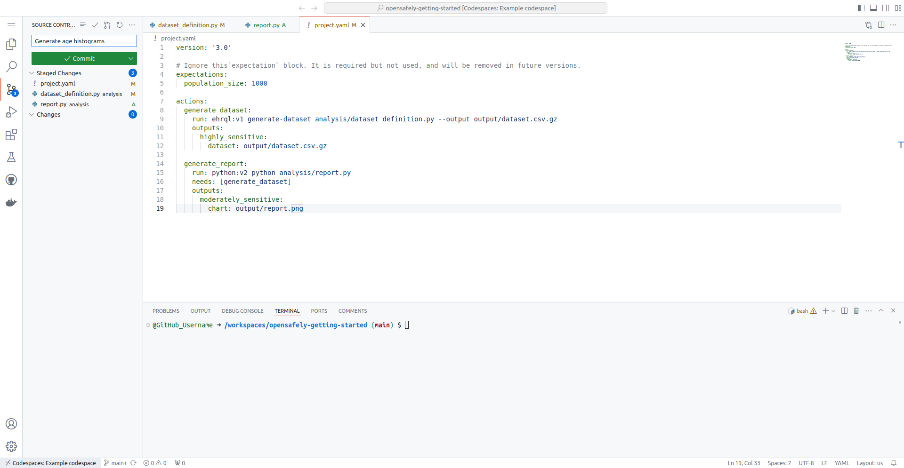
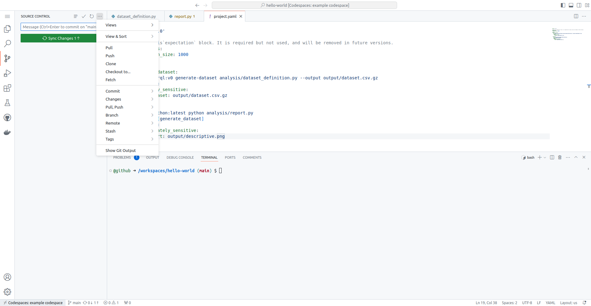

So far,
the changes you have made only exist in the codespace which you are working in.

In this section, you will first add the study changes that you've made
to a new *commit* in your repository — a commit represents a stored
version of your work — and then send that commit to GitHub by *pushing*
the new commit.

Pushing changes to your GitHub repository:

* ensures the changes you have made persist even when the codespace is deleted
* enables others with permission to access your repository to see those changes

## Add your changes to the local repository

(If you know how to use command-line Git, this works within
GitHub's terminal if you do not want to use Visual Studio Code's
Source Control feature.)

Back in the GitHub codespace, open the Source Control panel by
selecting the icon that has round dots connected by lines on the
left-hand side. It should be below the magnifying glass icon.

When files in the repository are edited and then saved, Source
Control should list those changes. Note that Visual Studio Code in
the codespace has Auto Save enabled by default. If you left-click on a file
in Source Control, you'll see how your copy of the file has changed
from the previous repository state. If you hover over a file in
Source Control under "Changes", you can propose to add the changes
to the repository by clicking the `+` icon next to the filename.
These "staged" changes then appear in the "Staged Changes" section.

Staged changes are changes that you are proposing to include in the next *commit* of
this study repository. These could be modifications of existing
files or entirely new files that you include.

It is also possible to "Discard Changes" if you accidentally stage a
file that you do not want to include. You can do this by hovering
over a file listed in the "Staged Changes" section and clicking the
`-` icon next to the filename.

When you've finished staging all your changes, you are now ready to
make the new commit:

1. Type "Generate age histograms" where it says "Message" above the Commit button.
   This messages summarises what your staged changes do.
1. Click the Commit button or press ++ctrl+enter++
   to *commit* the staged changes to
   add them to the repository as stored in the codespace.

## Push the changes to GitHub

The changes have been stored as a new commit in the codespace's
*local* copy of the repository. We now need to *push* the
repository to GitHub to make the changes show up there.

Click the "Sync Changes" button to push your commits.  Alternatively,
click the ellipsis (`⋯`) icon next to "Source Control" and then select
"Push". This should submit your changes to the GitHub repository that
you created earlier.

You will see a prompt: 'This action will pull and push commits from
and to "origin/main".' — click OK.

## Seeing the changes in the GitHub repository

The repository was created at:
`https://github.com/<your_github_username>/opensafely-getting-started`

If you now visit the repository on the main GitHub site,
you should see the updated state of the repository
with the changes you made in the codespace.

---

* Previous: [Add a scripted action to the pipeline](../add-a-scripted-action-to-the-pipeline/index.md)
* Next: [Check the automated tests pass](../check-the-automated-tests-pass/index.md)
