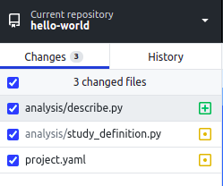

`git` is a command-line tool for recording, sharing and collaborating on code.

[GitHub](https://github.com) is a Microsoft-owned company (and website) that makes it easy to use `git`, and adds extra collaboration and security tools on top.  They also make GitHub Desktop, a convenient graphical user interface for git.

GitHub provide good [guides and documentation about best practices](https://guides.github.com/). The [hello-world walkthrough](https://guides.github.com/activities/hello-world/) is essential reading for new users, and the [GitHub flow slideshow](https://guides.github.com/introduction/flow/) summarises some best practice. If you prefer learning via video, there is also a [GitHub Youtube Channel](https://www.youtube.com/channel/UCP7RrmoueENv9TZts3HXXtw).

## GitHub workflow

The general workflow for making changes to your code is as follows:

* Create a clone — a copy — of the existing code repository to work on
* Create a new branch. A branch is a way for you to record and publish your own changes without breaking things for other people who are using the same code. It is also a good way of collecting changes ("commits") into a meaningful unit that can be reviewed by others.
* Edit/add/delete files in the repo on that branch, committing regularly with informative commit messages.
* Push the changes to GitHub, so that others can view the branch.
* Continue to commit and push changes on that branch until you believe it's ready to be merged back into the main codebase that everyone uses.
* Submit a pull request (PR), requesting that the branch be reviewed by somebody else. A PR is simply a way of viewing, commenting on, and approving code to be merged, "pulled" into the main codebase.
* Watch out for the automated tests passing or failing!

For a more generic overview, see [GitHub's own guidance](https://guides.github.com/introduction/flow/).

## Cloning the study code to your computer with GitHub Desktop

    Please follow [GitHub's instructions](https://docs.github.com/en/desktop/contributing-and-collaborating-using-github-desktop/adding-and-cloning-repositories/cloning-a-repository-from-github-to-github-desktop)
    for cloning study code with GitHub Desktop.

## Pushing changes to GitHub with GitHub Desktop

1. Open GitHub Desktop to view your repository. When you make changes to files in
   your text editor and save them locally, you also see the changes in
   GitHub Desktop. To add all changes in all files to a single "*commit*", tick the
   checkbox at the top of the list. 
  
1. At the bottom of the list of changes, in the **Summary** field, type a short,
   meaningful description of the changes (this is called the *commit message*).
   Optionally, you can add more information about the change in the
   **Description** field. Press the blue button to make the commit. 
  
1. Click **Push origin** to push your local changes to the remote repository on
   GitHub 

---8<-- 'includes/glossary.md'
