## Introduction

The OpenSAFELY research template contains a configuration
to allow you to run OpenSAFELY
**without any installation required on your own computer**.

This uses GitHub Codespaces.
GitHub provide users with a free monthly quota of Codespaces use.

This page explains:

* what GitHub Codespaces is
* how to run some OpenSAFELY features in GitHub Codespaces
* how GitHub's free user quota for Codespaces works

You only require a web browser to follow the instructions in this page.

## What is GitHub Codespaces?

[Codespaces](https://github.com/features/codespaces) is a coding environment
hosted online by GitHub.
Codespaces can be accessed via your web browser
without any additional installation.

A codespace provides:

* a "virtual machine" — a computer running as software inside *another* computer
  — that is hosted by GitHub
* a Visual Studio Code environment
  for editing your project and running commands

When you open a codespace in browser,
you get access to the Visual Studio Code environment.
Through that interface,
you can run commands inside the codespace's virtual machine.
This is just as if it were a real desktop or laptop that you were working on,
except this virtual machines has been configured for OpenSAFELY use.

This removes the need to have anything other than a web browser installed
to work on OpenSAFELY projects.

## Create a GitHub account

Before starting with OpenSAFELY in GitHub Codespaces,
you will need a free GitHub account.

If you do not already have a GitHub account,
go to the [GitHub pricing page](https://github.com/pricing),
and choose to sign up with a free account.
The screenshot below shows this.

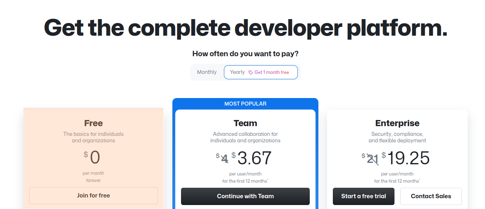

Follow the rest of the sign up process on GitHub's site.

## Sign in to GitHub

Whether you have created a new GitHub account,
or are using an existing GitHub account,
make sure you are [signed in](https://github.com/login) to your GitHub account.

The options to create a code repository and codespace only appear when logged in.

## Using GitHub Codespaces for OpenSAFELY projects

To start a Codespace,
you first need to create a code repository.
From that repository,
you can create a codespace.

!!! info
    A "code repository" is where code gets published on GitHub.
    This is not to be confused with a codespace.

    A codespace refers specifically to a virtual machine environment,
    that contains a *copy* of your repository code to work on.

We will use the OpenSAFELY research code template
as a starting basis for our code.

### Create a code repository for your work

You only need to create a code repository once for a particular project.

Create a new research code repository based on the research template.

1. In your web browser,
   go to the [research code template repository](https://github.com/opensafely/research-template).
1. Click the "Use this template" button
   to begin the process of creating a new research code repository for you to work on.
   The screenshot below shows this.

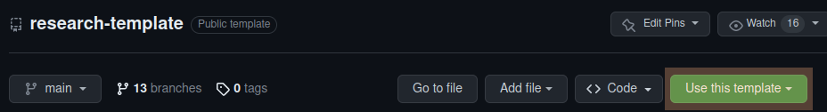

There are several options given
when creating a new repository from a template.

Here is a quick summary of what you should choose:

* You should choose *your own GitHub user account* as the repository owner.
* You can enter any name and description that you choose for your repository.
  For this example,
  we will use `opensafely-example` as the name.
* For this example,
  it does not matter whether the repository visibility is public or private.
* You do not need to select "Include all branches".
* You can ignore the mention of "GitHub Apps from GitHub Marketplace"
  in GitHub's instructions for creating a new repository from a template.

If you are unsure of what to do,
refer to GitHub's step-by-step instructions for [creating a new repository from a template](https://docs.github.com/en/repositories/creating-and-managing-repositories/creating-a-repository-from-a-template#creating-a-repository-from-a-template).

!!! warning
    Creating a repository with your GitHub user account
    will enable you to:

    * work on your OpenSAFELY research code in Codespaces
    * check that your research code works with the OpenSAFELY platform

    **It will not allow you to run code on OpenSAFELY's platform.**

    For that, you would have to request that your repository is transferred to the `opensafely` organization.

    Approved OpenSAFELY users are able to create a repository within the `opensafely` organization directly.

### Create a codespace

Once you have a research code repository created,
you can create a codespace from that repository:

1. In a web browser,
   go to your newly created research code repository on GitHub.
1. Click the "Code" button
1. Select "Create codespace on main".
   The screenshot below shows this.

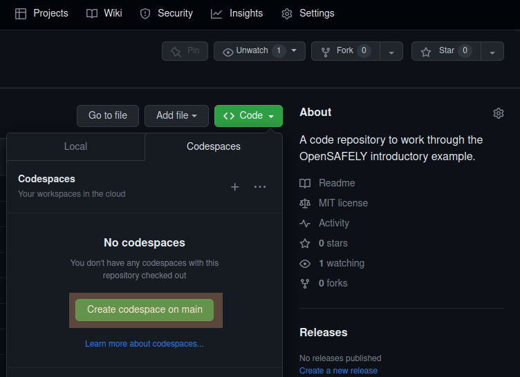

When you create a codespace,
GitHub has to set up the codespace.
The screenshot below shows this.

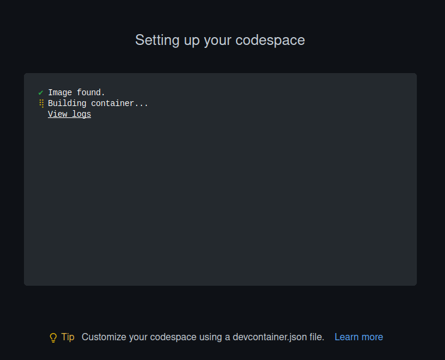

It may take a few minutes before the codespace is ready for use.

!!! info
    "main" is the current Git branch
    and what we will use for just trying everything out here.

    If you are working on another repository branch,
    it is possible to select "New from options",
    which allows you to choose the branch.
    The screenshot below shows this.

    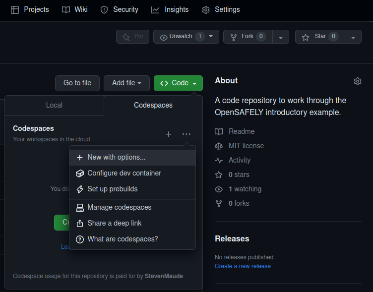

### Navigating the codespace

When the build process for the codespace completes,
you should see a Visual Studio Code editor with three panes.

Briefly, when you first open Visual Studio Code, you will see:

* at the far left, a vertical bar of icons showing various options
* on the left, the project's files and folders in the file explorer
* a terminal at the bottom-right
* a file editor at the upper-right;
  this initially remains blank until you open a file

The screenshot below shows this.

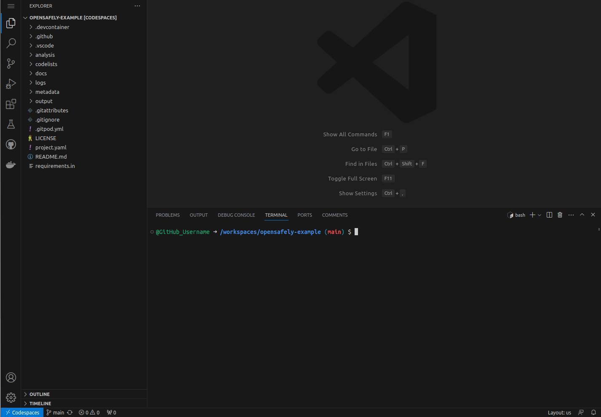

!!! info
    There are other elements to the user interface.
    If you are unfamiliar with Visual Studio Code, you can:

    * refer to the [explanation in GitHub's documentation](https://docs.github.com/en/codespaces/developing-in-codespaces/developing-in-a-codespace#working-in-a-codespace-in-the-browser)
      for more details.
    * refer to the [Visual Studio Code user interface documentation](https://code.visualstudio.com/docs/getstarted/userinterface)

It is possible to resize the different panes as needed
by hovering on the dividers between sections of the screen.

### Working with files

#### Editing code

The file explorer shows the contents of your code repository.

You can open files and folders by clicking on them.

#### Saving files in the codespace

The codespace is currently configured to autosave files when modified.

#### Reverting changes to files in the codespace

You can do this via the Source Control panel in the Visual Studio Code interface.

1. Select the Source Control panel on the left-hand side.
2. You should see a list of the changes.
3. You choose to "Discard Changes" for each file.
   This reverts the files back to how they are in the current version of the repository.
   The screenshot below shows this.

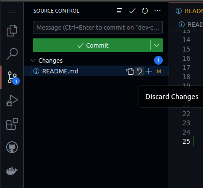

!!! info

    For users comfortable with command-line Git,
    you can use `git` in the terminal to work with the repository,
    including reverting changes.

    This page will not cover use of command-line Git.

#### Updating files in the repository

You can use the Source Control panel to update files in the repository.

A codespace is self-contained with its own copy of your repository's files.
This is just as if you were working on a local copy of the repository on your own computer.

**Changes to the copy of your repository in the codespace do not automatically change the state of your published repository on GitHub.**

To get changes from a codespace to the GitHub repository, you must use the Source Control view to add, commit and publish those changes
to your GitHub repository.
If you are unfamiliar with Visual Studio Code and GitHub,
[GitHub has a guide on using this](https://docs.github.com/en/codespaces/developing-in-codespaces/using-source-control-in-your-codespace#committing-your-changes).

When you update files by publishing to the repository's `main` branch,
this should trigger an automated check of whether your code will run in OpenSAFELY.
These checks can be viewed from the Actions tab,
accessed via your repository on GitHub's site.
The screenshot below shows what this tab looks like..

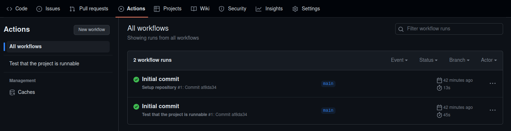

!!! info
    If you are comfortable with Git,
    you can also [create and switch between different branches in the codespace](https://docs.github.com/en/codespaces/developing-in-codespaces/using-source-control-in-your-codespace)
    in the Visual Studio Code interface
    or by the terminal using command-line Git.

## A quick overview of what is included in the codespace

Now that we have a GitHub codespace running,
we can use OpenSAFELY.

Here is a short, non-exhaustive guide to what OpenSAFELY provides in the codespace.

### Run the OpenSAFELY command-line interface (CLI)

* You can run the OpenSAFELY CLI in GitHub Codespaces.
  In the Visual Studio Code terminal, type `opensafely` and press ++enter++.
* You should see the OpenSAFELY CLI help prompt.
  The screenshot below shows this.

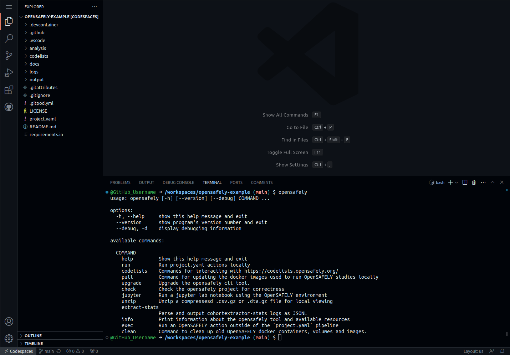

!!! info

    See the [OpenSAFELY CLI](opensafely-cli.md) documentation for more details.

### Run the example project

The research code repository that you created already has an OpenSAFELY project in it.
We can try this out to show that everything works
as if we had installed the OpenSAFELY CLI.

#### Ensure you are in the correct directory to run the project

* By default, the terminal that has opened should be in the correct directory (folder)
  that contains the `project.yaml` file.
* This directory is `/workspaces/opensafely-example`
* You can check the current working directory by referring to the terminal prompt.
* If necessary, you can *change directory* to the correct directory by typing:
  `cd /workspaces/opensafely-example` and pressing ++enter++.

#### Use OpenSAFELY CLI to run the example project

* In the Visual Studio Code terminal,
  type `opensafely run run_all` and then press ++enter++
  to run the existing `project.yaml`.
* This may take a few moments to download the required Docker images,
  before the project is run.

You should see some information messages that should end something like:

```
=> generate_study_population
Completed successfully
```

The screenshot below shows this.

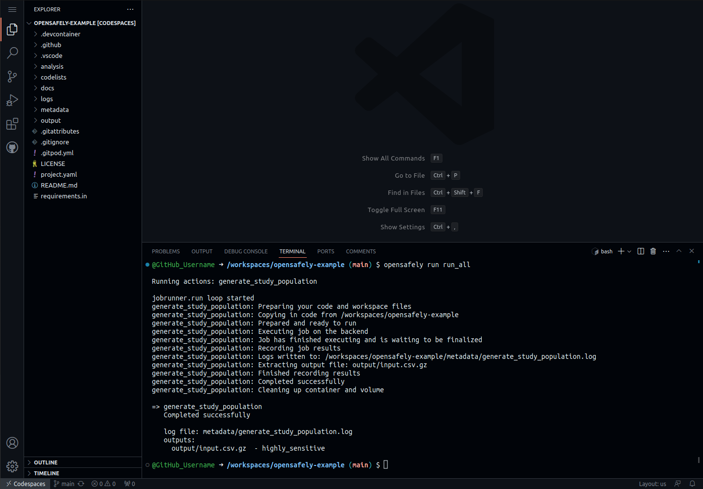

!!! info
    The research code example project is currently based on a legacy cohort-extractor project
    using a *study definition*.

    In future,
    we will amend this example to be based on ehrQL.

    [ehrQL](ehrql/index.md) is the replacement for cohort-extractor
    and should be used to write *dataset definitions* for new OpenSAFELY research.

    cohort-extractor and ehrQL are used to extract details of populations of interest
    from OpenSAFELY backends.

## Other features for development

### ehrQL code autocompletion and reference information

There is support for autocompletion of ehrQL
that provides the [language reference information](ehrql/reference/language.md)
in the Visual Studio Code editor.

The screenshot below shows this.
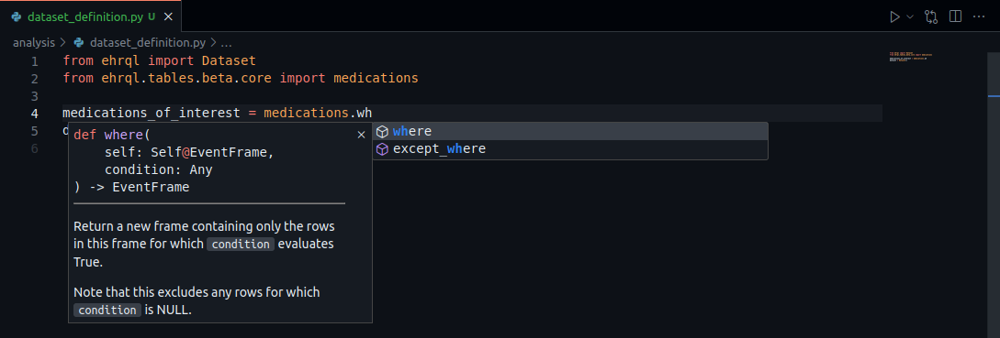

!!! warning
    This is still being tested.

    This still shows parts of ehrQL that do not form part of the public interface.
    These mostly have a double underscore `__` prefix.

### Running Jupyterlab

* In the Visual Studio Code terminal,
  type `opensafely jupyter` and then press ++enter++
  to launch the Jupyterlab server.
* This may be useful to develop Python-based analyses interactively
  based on dummy data outputs.
* Your web browser should open a new tab or window
  or prompt you if you want to open a new tab or window.
  This new tab or window allows you to use the Jupyterlab server.
* If this tab or window does not display,
  you can navigate to the Ports tab in the terminal,
  which will show the web address to the running server.
  The "Running Process" entry should start `/usr/bin/docker-proxy…`
  Click on that link to access the Jupyterlab server.
  The screenshot below shows this.
  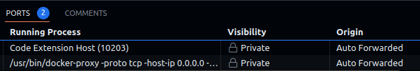
* You can edit files in your codespace from within Jupyterlab.

!!! warning
    Unlike the Visual Studio Code interface,
    files do not save automatically in Jupyterlab.
    You must save them manually.

!!! warning
    You will still need to use Visual Studio Code to publish those changes made in your codespace,
    to your code repository
    [as detailed above](#updating-files-in-the-repository).

### Running command-line Python

* In the Visual Studio Code terminal,
  type `opensafely exec python` and then press ++enter++
  to start command-line Python.

### Running command-line R

* In the Visual Studio Code terminal,
  type `opensafely exec r` and then press ++enter++
  to start command-line R.

!!! info
    We may look into providing a better experience for developing R code in future.

### Running command-line Stata

!!! info
    This has not yet been tested,
    but could be added in future.

### Other built-in operating system tools

The current Codespaces configuration is based on Linux.
Common command-line tools that you might expect from a Linux installation,
such as `cat`, `grep` and more are available to use in the Visual Studio Code terminal.

!!! info
    You do not need to know how to work with Linux
    to be able to use OpenSAFELY in Codespaces.

## Use of GitHub Codespaces computer resources

The default codespace has 2 computer processor cores (CPU cores) and 4 GB memory (RAM).
In some cases,
you may find that OpenSAFELY projects exceed the available RAM.

GitHub Codespaces does have virtual machines with more CPU cores and RAM,
but these will use your free quota more quickly.

It is possible to configure what virtual machine type the codespace has when launching the codespace.
See [GitHub's explanation of configuring advanced options](https://docs.github.com/en/codespaces/developing-in-codespaces/creating-a-codespace-for-a-repository?tool=webui#creating-a-codespace-for-a-repository) for a codespace.

It is also possible to [change a virtual machine type for an existing codespace](https://docs.github.com/en/codespaces/customizing-your-codespace/changing-the-machine-type-for-your-codespace#changing-the-machine-type).

## GitHub Codespaces billing

GitHub gives all users a free and decent-sized monthly quota for Codespaces.
This is accessible without a paid account.
See [GitHub's pricing details](https://docs.github.com/en/billing/managing-billing-for-github-codespaces/about-billing-for-github-codespaces).

!!! note
    You will not get billed for using Codespaces,
    unless you both:

    * set a Codespaces spending limit
    * and add a payment method

    Without billing configured,
    you will not get invoiced or charged.

    If you run out of free quota,
    GitHub can only block you from using Codespaces until the next monthly cycle starts.

### Managing codespaces

If you close a codespace in your browser,
it still continues running.
You can return to an open codespace from the code repository
by clicking the "Code" button.
The screenshot below shows this.

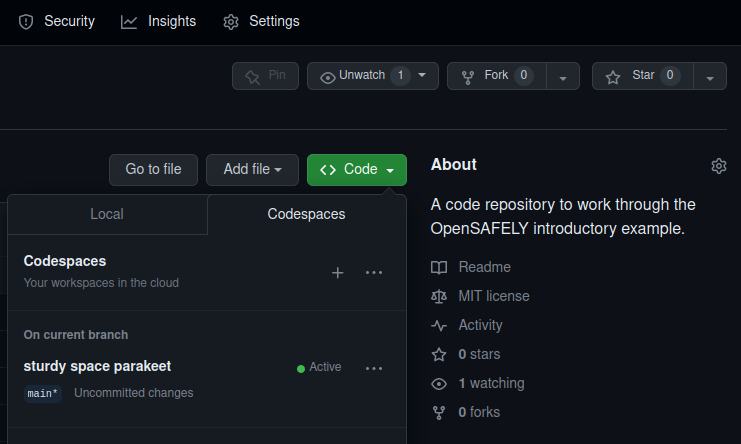

It is useful to stop or delete codespaces to prevent them from using your quota unnecessarily.
There are options in this panel to do so.
The screenshot below shows this.

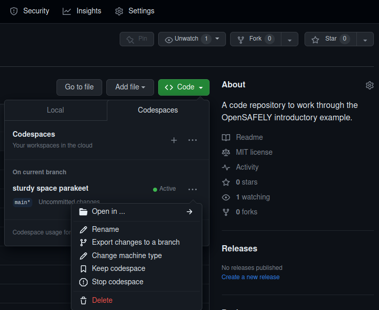

!!! note
    GitHub has a ["Your codespaces" page](https://github.com/codespaces/)
    that also allows you to manage all of your current codespaces.

#### Stopping a codespace

See GitHub's documentation for how to stop a codespace.

This stops a codespace running,
but allows you to restart it.

Stopped codespaces still incur storage usage,
but not CPU usage.

#### Deleting a codespace

See GitHub's documentation for how to delete a codespace.

Unlike *stopping* a codespace,
this removes the codespace entirely,

!!! info

    If you have changes in the codespaces that have not been published to the repository,
    GitHub will warn you to confirm that you are sure you want to delete the codespace.

    The "Export changes to a branch" option allows you to save the changes
    without having to go back into the codespace.

Once deleted, the codespace will not incur any usage.

#### Idle timeout

A codespace will eventually stop when it is not being used..
This is a useful feature to prevent you from wasting free or paid Codespaces credit.
This setting can be configured to give a longer or shorter duration.
[See the GitHub documentation](https://docs.github.com/en/codespaces/customizing-your-codespace/setting-your-timeout-period-for-github-codespaces).

## Visual Studio Code telemetry settings

This does not seem to be easily disabled by the Codespaces configuration.
However, you can disable this manually through Visual Studio Code's settings,
and should only need to do this once for it to apply to all codespaces you create.

See [GitHub's information on Visual Studio Code's telemetry for more details](https://docs.github.com/en/site-policy/privacy-policies/github-codespaces-privacy-statement).

## Feedback

We are still investigating how we can make Codespaces more useful
for researchers working on OpenSAFELY projects.

Please feel free to ask us questions,
tell us about problems you find,
or give us any other feedback
on the use of Codespaces with OpenSAFELY
or this documentation.

Ways to contact us are listed on our ["How to get help"](how-to-get-help.md) page.
