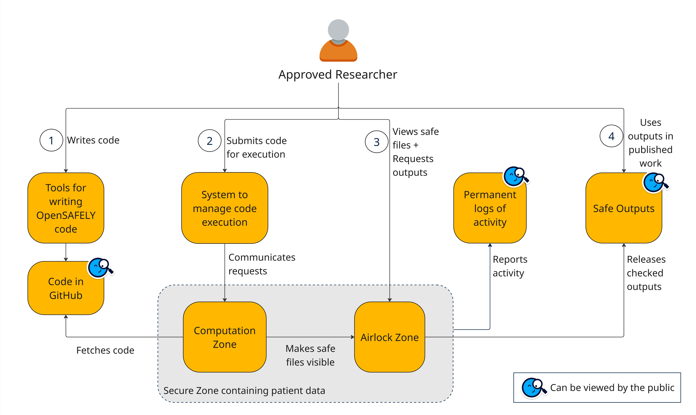

# A high level overview of how OpenSAFELY works

Once a research project is approved, the Approved Researcher is given permission to access the system to manage code execution, which allows them to run code against patient data in the Secure Zone as appropriate for their project. There is extensive documentation for OS, including [step-by-step getting started guidance](getting-started/index.md) - this diagram provides a high-level overview of how the system works.

1. The researcher has access to various tools ([see below](#tools-to-help-with-writing-code)) that allows them to design and write code that will enable them to run their analysis on patient data via the OpenSAFELY system. Using these tools, they write and test their ehrQL and analytical code (R, Python or Stata) in Github before it is run in the Secure Zone. Github is used to store code and help with collaboration and versioning. The code can be tested and perfected/improved on a dummy dataset.
1. Once the code is written, the researcher can log into the system to manage code execution and run a specific section of code or their entire code against a patient dataset. They use the system to manage code execution via the jobs site.
    1. This request is sent to the Secure Zone which operates within the data controllers’ domain (e.g.TPP or Optum). Within the Secure Zone, the code is run against the sensitive patient data generating an output.
1. Once the code has run, researchers can review the output (safe files[^1]) within Airlock, a tool hosted in the Secure Zone.
When the researcher is satisfied with the output, they submit a request for the results to be released, allowing the results to leave the data controller’s domain.
1. The [output checkers](outputs/output-checking.md) review the output to ensure it contains no sensitive or disclosive information and is consistent with project approval (safe outputs[^1]). Once approved, the released results become accessible to the researcher via the jobs site.

**Permanent logs of activities** - These are records of all the code (extraction and analytical code) run against patient data for a project, as well as all the outputs that have been released from the Secure Zone. The public can view when and who submitted [each request to run code against the patient data](https://jobs.opensafely.org/#events) and when and who released the outputs.
This supports transparency and auditability across the research lifecycle.

---

### Tools to help with writing code

a. [Github codespaces](getting-started/how-to/use-github-codespaces-in-your-project/index.md) A ready-to-use cloud development environment you can access from anywhere without installing anything on your computer.

b. [Github repo template](https://github.com/opensafely/research-template) A starter repository you can copy to create new projects quickly.

c. [Project.yaml](actions-pipelines.md#projectyaml-format) A configuration file within your project's repository that defines your project’s settings and structure.

d. [Table schemas](ehrql/reference/schemas.md) + [metadata](data-sources/index.md) Table schemas define the tables and columns available to query in a dataset definition. Metadata provides contextual information on the core primary care EHR systems inside which OpenSAFELY is built (currently TPP and EMIS), as well as all external datasets imported to the secure EHR environment.

e. [OpenCodelists](codelist-intro.md/#opencodelists) A system for building, reviewing and maintaining codelists

f. [ehrQL](ehrql/index.md#ehrqls-documentation) Electronic Health Records Query Language: a query language and software tool designed for working with health data

g. [Dummy data](ehrql/how-to/dummy-data.md) Sample data used for developing analytic code on your own computer

h. [OpenSAFELY CLI](opensafely-cli.md) The main tool for using a version of the OpenSAFELY platform on your computer to test your code

i. [Docker Images](actions-scripts.md#execution-environments) Prebuilt packages for running software containing R, Python and Stata - these contain the specific software versions that are installed within the Secure Zone

j. [CI checks](actions-pipelines.md#running-your-code-with-github-actions) Automated tests that will check that the analytical code will run successfully in the Secure Zone.

[^1]: Safe in this context means the [5 Safes framework](https://www.bennett.ox.ac.uk/blog/2023/03/the-five-safes-framework-and-applying-it-to-opensafely/), which OpenSAFELY is designed around.
