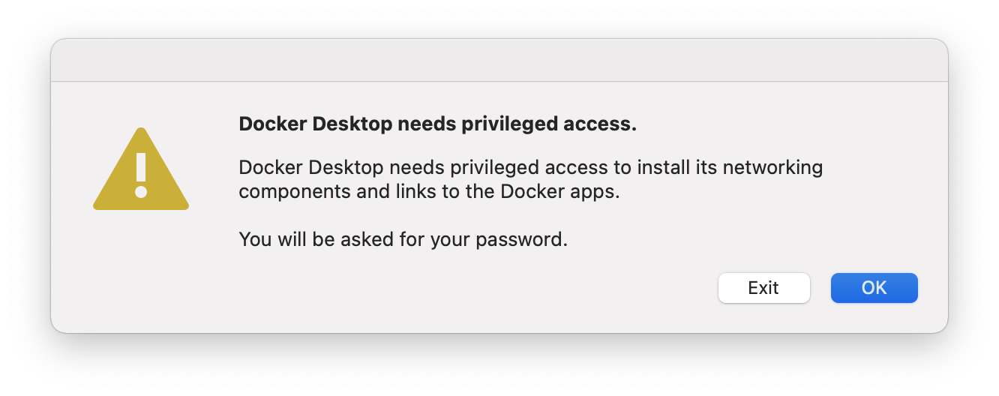
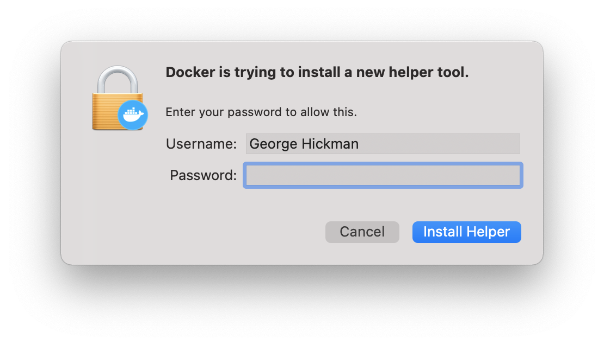
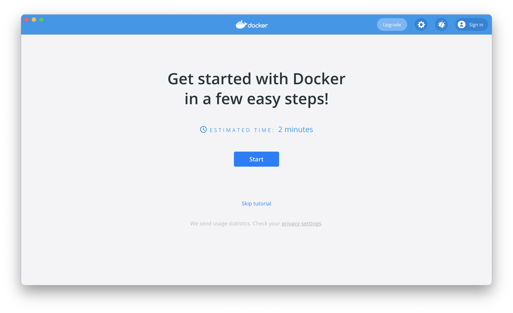

# macOS Install Guide

!!! note "This guide was created using macOS 11.1"
    It is expected that this guide should work from 10.14 upwards but has only been tested with 11.1

Open Terminal.app by clicking the magnifying glass icon in the top right of your screen.
Type `terminal` and hit enter.

Install [Homebrew](https://brew.sh/), this should install the Xcode Command Line Tools for you as well.

!!! note "This command might take a while to run depending on the speed of your internet connection."

```bash
/bin/bash -c "$(curl -fsSL https://raw.githubusercontent.com/Homebrew/install/HEAD/install.sh)"
```

Once homebrew is installed use it to install [pipx](https://pipxproject.github.io/pipx/) and [pyenv](https://github.com/pyenv/pyenv):

```bash
brew install pipx pyenv
```

Add pipx to your path with:

```bash
echo 'export PATH="$HOME/.local/bin/:$PATH"' >> ~/.bashrc
```

and reload your shell environment with:

```bash
source ~/.bashrc
```

Next, install [Docker for Mac](https://docs.docker.com/docker-for-mac/install/), [GitHub Desktop](https://desktop.github.com/), and [Visual Studio Code](https://code.visualstudio.com/):

```bash
brew install --cask docker github visual-studio-code
```

Use pyenv to install Python:

!!! note "This command might take a while to run depending on the speed of your computer."

```bash
pyenv install 3.9.1
```

Then install the [OpenSAFELY CLI](../opensafely-cli) with pipx, using the Python installed in the previous step:

```bash
pipx install opensafely --python ~/.pyenv/shims/python3.9
```

Test the installation of OpenSAFELY CLI.
This should print out the usage and available sub commands:

```bash
% opensafely --help
usage: opensafely [-h] [--version] COMMAND ...

optional arguments:
  -h, --help  show this help message and exit
  --version   show program's version number and exit

available commands:

  COMMAND
    help      Show this help message and exit
    run       Run project.yaml actions locally
    codelists
              Commands for interacting with https://www.opencodelists.org/
```

Set up Docker by opening the app you installed earlier:

```bash
open /Applications/Docker.app
```

You'll be warned about the system dialogue which is about to pop up, choose "OK".




Enter your password and click "Install Helper".




Now that the Docker application is open you can click "Skip tutorial" and close the window.
The Docker service will continue to run in the background and can be accessed from the Docker icon in your menu bar.




You're done!

Now you can navigate to a research repo, on your local machine, and [use `opensafely` via the command line](../opensafely-cli/#using-opensafely-at-the-command-line).
