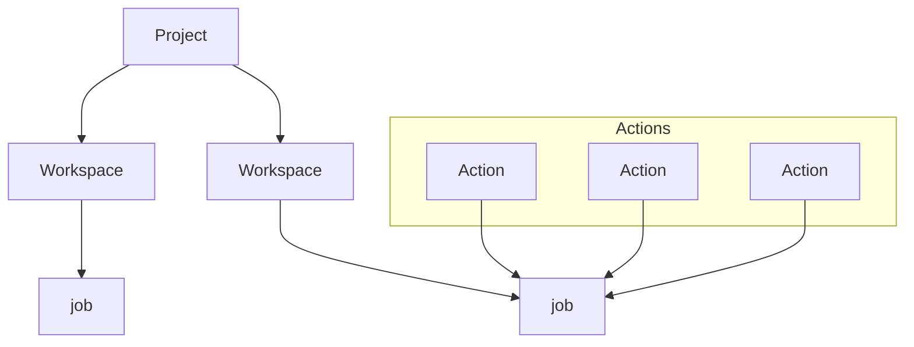

The [jobs site](https://jobs.opensafely.org/) is where you can run your code on the server against real data, view your analysis outputs on the server and view outputs that have been reviewed, approved and released from the server by our team of output checkers.

## Jobs site structure

The jobs site is centred around **Projects**. When an application to run a study in OpenSAFELY is [approved by the data controller](https://www.opensafely.org/onboarding-new-users/), a _Project_ is automatically created. You can see a list of approved projects, and the organisation they belong to [here](https://www.opensafely.org/approved-projects/). We will add any GitHub usernames listed in your approval to our `opensafely` [GitHub organisation](https://github.com/opensafely). We also will transfer your existing OpenSAFELY study repository (if you have one) into the same organisation. This allows OpenSAFELY to enforce certain security standards, such as [multi-factor authentication](https://docs.github.com/en/github/authenticating-to-github/securing-your-account-with-two-factor-authentication-2fa).

Within each _Project_, there are one or more **Workspaces**, which are linked to a GitHub repository in the [OpenSAFELY organisation](https://github.com/opensafely). Any [actions](https://docs.opensafely.org/actions-intro/) you develop within the attached repository are linked to the workspace, allowing these to be run against real data.  

From within each workspace, you can run **jobs**; each job is a selection of one or more actions. You can see all the _jobs_ that have been run on a workspace by clicking on "view logs" on the _Workspace_ page. You can see a log of all _jobs_ being run [here](https://jobs.opensafely.org/event-log/). 

### Output types

Once outputs have been produced by running _jobs_ from within a _Workspace_, there are several stages they must go through before being made publicly available:

1. **Outputs on the [Level 4 server](https://docs.opensafely.org/level-4-server/)**. These are outputs marked as `moderately_sensitive` in the `project.yaml` file and are only viewable when logged into the Level 4 server. These outputs have to be [reviewed by our output checking team](https://docs.opensafely.org/releasing-files/#3-how-are-files-reviewed) before they can leave the server.
2. **Released outputs**. These are analysis outputs that have been reviewed for any [disclosivity issues](https://docs.opensafely.org/releasing-files/#types-of-disclosure) and released from the Level 4 server by the output checking team to the relevant _Workspace_ on the Jobs site. These are only viewable if you have the correct permissions for the _Project_ the _Workspace_ belongs to.
3. **Draft public outputs**. Released outputs can only be shared with close collaborators of your projects (examples of who this could include can be found [here](https://www.opensafely.org/policies-for-researchers/#all-datasets-sharing)). To be shared more widely, they have to first be approved by NHS England. Once approved, and if you have the correct jobs site permissions, you can create draft public outputs for approval.
4. **Published outputs**. Once approved, draft public outputs are made publicly available to view by anyone through the _Workspace_ they belong to.

### Permissions

When users are approved to use the OpenSAFELY platform, each user is assigned roles that define what they are permitted to do on the jobs site. By default, most researchers using the platform will have the **ProjectDeveloper** role for a specific _Project_, which permits them to:

* Create workspaces in that _Project_
* Run _jobs_ in _Project_ workspaces
* Cancel _jobs_ for this _Project_
* View job outputs for any _Workspace_ in this _Project_
* Create draft public outputs for approval

Users with the **ProjectCollaborator** role can:

* View released outputs
* View draft public outputs
 
There are some additional roles linked to the release of outputs from the server, reserved for output checkers:
 
**OutputChecker**:

* Release outputs from Level 4 environments
* Delete outputs in a release
 
**OutputPublisher**:

* Publish draft public outputs
## Creating a Workspace

* **Log in** using your GitHub credentials
* **Create a Workspace**:
    * Click the `Create a new workspace` button.
    * Pick a _Project_ from the list.
    * Click the `Create a new workspace` link.
    * Choose a name, for example the name of the repo.
    * Select the repo and branch whose action you want to run (in most cases, the branch will be either `main` or `master`).
    * Click `Create`.

When you add a new repository in the opensafely organisation, it may take up to 15 mintutes for it to be available to select at https://jobs.opensafely.org
## Running your code on the server

*  **Select actions** to run:
    * Select the actions you want to run by clicking the `Run` buttons.
    * If any of these actions have dependencies then they will also be run, unless their outputs already exist. 
      * If any dependencies have already been set to run, your current job will be queued until dependencies have completed.
    * Dependencies can be viewed by clicking the `Needs` button.
    * You can force dependencies to be run by clicking `Force run dependencies`, even if those actions have already been run.
    * You can choose to send notifications for the selected actions to your email address.
    * When you're ready, click `Submit`.

The workspace is available at `https://jobs.opensafely.org/<WORKSPACE_NAME>/`.
You can view the progress of these actions by click the `Logs` button from the workspace, or going to `https://jobs.opensafely.org/<WORKSPACE_NAME>/logs`. If you selected to receive notifications, you will also receive an email to notify you when each job completes.

When you submit a job-request you are competing with other users for resources on the server. As such, jobs can sometimes take a while to start even if their dependencies have successfully completed.

Click here for information on the exact steps that occur when each job is run on the server

What happens:

1. A new, empty temporary directory for the job is created.
2. Copy in all files on the selected branch.
3. The job is run.
4. All the files matching the specified output patterns are copied into the local repo.
5. The log files for the job are saved into the `metadata/` directory.
6. The temporary directory is deleted.

Each job will either succeed or fail. In either case, the output and log files are only visible in the secure environment to avoid disclosure of potentially sensitive information.

## Viewing analysis outputs on the server

You can view `moderately_sensitive` outputs from any of your submitted _jobs_ via the Jobs website **if you have access to and are logged into the backend the job was run on**.

Once you are logged into the server:

* Navigate to https://jobs.opensafely.org/ using google chrome (make sure to use https://)
* Log in using your GitHub username
* Navigate to your _Workspace_
* Under _Releases_, navigate to Level 4 Outputs
* Choose the correct backend
* Pick the file you would like to view from the list of files

## Viewing released outputs

Any files that you would like to be released from the server, have to first be checked by our team of output checkers. You can find instructions for requesting a release [here](https://docs.opensafely.org/releasing-files/#2-requesting-release-of-outputs-from-the-server).

Once reviewed, approved and released, your requested files will be available to view from your _Workspace_ in the _Released Outputs_ section of Releases. To view released outputs, you need to have the **ProjectDeveloper** or **ProjectCollaborator** role. If you would like to add a project collaborator to your _Workspace_, please read [this section](https://www.opensafely.org/policies-for-researchers/#all-datasets-sharing) of the researcher policy document and contact your co-pilot.

## Publishing outputs

You must seek NHS England approval for any publication or wider sharing of results, papers, presentations (e.g. submitting to a journal or a pre-print server, or uploading to any public facing website. 

For instructions on how to request approval, please see [this section]((https://www.opensafely.org/policies-for-researchers/#all-datasets-publication) of the researcher policy document. You should also create draft public outputs for review. To do this, navigate to the _release_ containing the outputs you would like to be published and click the `Publish` button.

Once approved, your released outputs will be “published” and viewable from the published outputs in the `Published outputs` section of your `Releases`. This is accessible by everyone, even those without a login.
