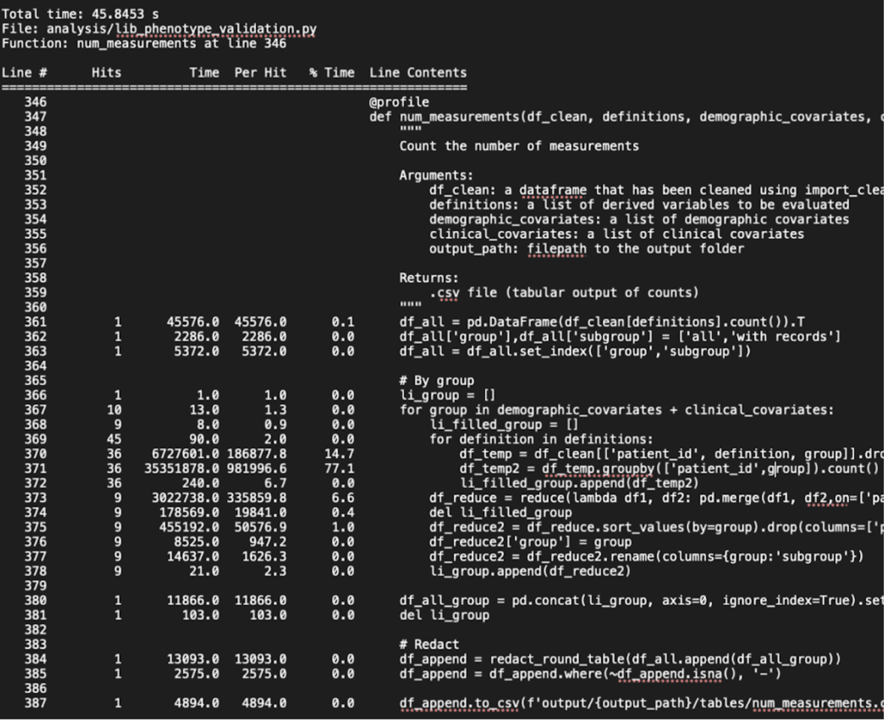

This section provides advice on reducing memory usage for scripted actions to ensure that your job request is feasible to run and will complete as soon as possible. While there is specific guidance geared toward R and Python, the principles can also apply to other languages (such as Stata).

## Use proper typing

Objects like vectors, data frame columns, and matrices use different amounts of memory, depending on their type and class. You should use the class that minimises memory use whilst preserving information. 

In general, for memory use of types in R assume that (`logical` = `integer`) < `double` < `character` (in Python `logical` is equivalent to `bool`, `float` to `double`, and `object` to `character`). Note that factors (`categorical` in Python) are integers in disguise, with a small amount of metadata (or attributes) to map the factor levels to the underlying integer value. Similarly, dates are doubles in disguise, with attributes defining the date origin. In R, the memory use of class attributes is usually negligible, so you only really have to consider the underlying data type.

In R, use `typeof()` and `class()` to look under the hood and see if memory savings could be made. A quick way to show the class for every column in a data frame is `t(t(sapply(data.frame, class)))`. In Python, use `Series.dtype()` to get the data type of a single column and `DataFrame.dtypes` to get the data type of every column.

The most likely savings are `double` to `integer` (`float` to `int` in Python) and `character` to `factor` in R (`object` to `categorical` in Python).

* If a column contains only integer values, type it as an integer not a double. It’s common for integers to sneakily convert back to doubles. For example, if `x` is an integer, then `y <- x + 1` is a double, because `1` is a double and combining an integer and a double will give a double. Instead, use `y <- x + 1L` which is an integer because `1L` is an integer.
* If a column contains only a few different string values, it’s usually better to convert it from a character to a factor. In fact, because there is no free-text info in OpenSAFELY, _in theory_ all string-type variables, including derived variables, should only contain values from a known set, and so could all be represented as factors. But in practice this might not be simple to enforce, and might be actively unhelpful if lots of theoretically possible values are not actually represented. So some character variables are permissible. Use your judgement.
* A DataFrame column can have only one data type. Inputting a value with greater precision (`float` instead of an `int`, for instance) can lead to the entire column converting to a more memory-consuming data type. For instance in Python, `np.nan` is a `float` value. Inserting `nan` in an `int` column will convert the entire column to a `float`. 
  * The default behaviour of Pandas' [`read_csv`](https://pandas.pydata.org/docs/reference/api/pandas.read_csv.html) function when presented with an integer column with missing values is to use `NaN` for these missing values and thus load the column as a `float`.
  * [Nullable integer types](https://pandas.pydata.org/docs/user_guide/integer_na.html) are available which support missing values (albeit as `pandas.NA` rather than `numpy.NaN`), with a variety of precisions ( `Int8`,`Int16`,`Int32`,`Int64`). Providing a `dtype` specification to `read_csv` (or converting a `float` column after replacing `NaN` values with `NA`) using one of these types with the smallest required precision may significantly reduce memory usage.

## Slim down your datasets

* Only import columns that get used. Remove unused columns or rows.
* Avoid creating columns that contain the same information as other columns, just in a different format.
* Store single-value vectors as global variables, or in a list, rather than as a column in a dataset that repeats the same value.
* Avoid storing the same data across multiple datasets. Use look-up tables instead, and join the data on when needed.

## Remove or slim down large objects from memory

* Write code that loads or processes data in functions so that the source and/or intermediate datasets do not hang around for the whole duration of the script (thereby taking up memory). Also use functions for chunks of code that are repeated or re-executed.
* Sometimes there might be a long section of code to create an object, but that also produces lots of large intermediate objects. In R, you can wrap this section of code in `local()` so that only the final object is kept, without having to explicitly delete the intermediate objects. This also helps keep your working environment clean.
* Rather than importing data at the top of a script, import only when the data are needed. 
* Remove large objects from memory if they're no longer needed (`rm(x)` in R, `del x` in Python).
* In R, model objects (such as those produced by `lm`, `glm` or `coxph`) scale with the input data size, even if you use `data=FALSE` and `x=FALSE` and `model=FALSE` and the like to remove these components from the resulting object. The `butcher` package can help reduce size. For other big objects, check to see if there are components that can be omitted.

## Restructure your data 

Consider subdividing very wide or very long data into chunks. Can you divide the data into yearly chunks or run the script on each outcome separately and aggregate the results later? If the processes do not depend on one another, it will be possible for jobs to run in parallel to one another on the server, completing sooner than running in one continuous process. 

If you are extracting multiple events over time per patient, consider extracting covariates you expect to be time-invariant (e.g. ethnicity) separately, then merging it onto your outcome variables later (made easy using [cohort-joiner](https://actions.opensafely.org/actions/cohort-joiner/v0.0.27/)).

## Use random sampling

Say you’re studying 1 million people. Maybe just 50,000 is enough? Perhaps at least for preliminary work. In which case, let's take a random sample of 50,000 people which will reduce the dataset to a 20th of its original size.

Maybe a simple random sample doesn’t work because the outcome is rare. In case case keep everybody who experienced the outcome, and randomly sample the rest. In this case, the contribution of each person in the model should be reweighted by the inverse of the sampling probability – for those who experienced the outcome this is `1`, and for those who didn’t this is `N/n`, where `n` is number of non-outcomes who were sampled, and `N` is the total number of non-outcomes.

This is useful for preliminary development work for speed but may sometimes be a necessary design feature, for example if the analysis requires large, time-dependent datasets on millions of people.

## Parallelisation

Each core gives you access to a certain amount of memory. By parallelising operations across cores you get access to more memory.

Operations that are amenable to parallelisation include: GLM-fitting (Stata does this automatically, see the [parglm](https://cran.r-project.org/web/packages/parglm/index.html) package to do it in R); exact matching; bootstrapping; multiple imputation. Be considerate here: don’t access so many cores that other users will suffer. If you need to use more than 8 cores to get close to a sensible run time, then you should probably reconsider your approach.

You can also take advantage of OpenSAFELY’s actions/job-runner tooling to split operations across different actions, where appropriate.

## Use profiling tools to identify processes that can be optimised

Beyond selecting memory-efficient data types and removing large objects, finding memory efficiency gains will require profiling the code to identify the most memory-intensive processes and determining whether they can be optimised.

One possible method is to add print statements in your code to write to the log when getting to specific parts of the code. This will help you identify how long it took to get to a certain point in your code on the server. If your job did not successfully complete, it can also help you find out at what point in the code it failed.

Another method is to locally run line-by-line profiling tools to time the processes in your code on dummy data. For example, the `LineProfiler` package in Python provides the `@profile` decorator to get line-by-line execution time for each function. While this does not explicitly measure memory use, it helps to identify where your code is taking the longest, which may help you decode why it is running slowly on the server. You can get statistics like number of hits per line (multiple if in a loop), time taken per line, time taken per hit, and percentage of total time next to each line. You can run and save the output to a text file by running the following in the command line.

```bash
python [script_name].py
python -m line_profiler [script_name].py.lprof > [script_name].txt
```

Below is a screenshot of an example output.



In a Jupyter notebook, you can run an IPython magic command `%prun` before calling a function to get similar line profile results as a cell output.

While profiling can help identify which parts of the code is taking up the most memory or time, it does not guarantee that there will be optimisation solutions. Some processes are inherently more memory-intensive than others (e.g. sorting values). Additionally, depending on differences between the dummy data and real data, locally estimated timings may differ from timings based on real data.
