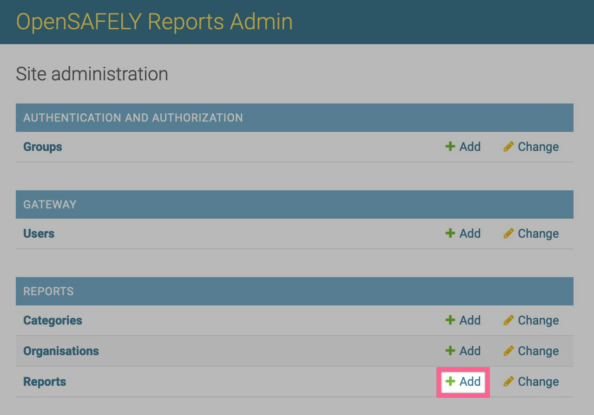
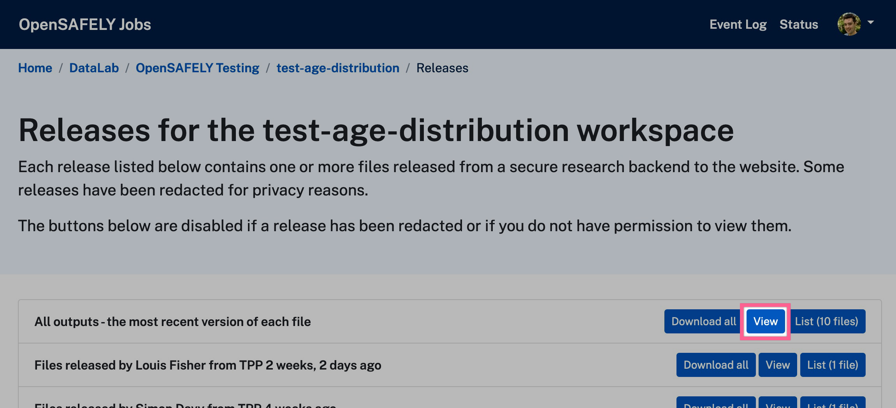
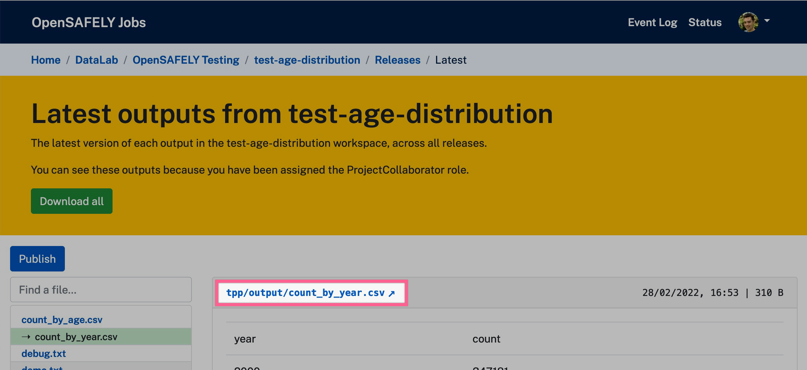

## Create a draft report
After logging into the [administration area](https://reports.opensafely.org/admin/) click "Add" next to Reports:

### Organisation
Select your organisation from the list.
If it's missing from the list, please [contact us](../how-to-get-help.md).

### Navigation
Pick the `Category` you want to host your report under in the side nav of the site.

Then set a `Menu name`.

### Report file details (GitHub)
!!! note
    It was previously possible to release outputs to GitHub and the reports site was originally built to use those outputs.
    OpenSAFELY has moved away from this method and all outputs are now released to the jobs site.
    Please make sure to use the jobs site field in this form for your output location instead of the GitHub ones.

### Report file details (Jobs site)
Find your workspace on [the jobs site](https://jobs.opensafely.org).
Click `Released Outputs` to view the most recent version of each of your released outputs:

Select the file you want to make your report with from the list on the left, and copy the direct URL which shows at the top of the file viewer.  This is the URL you will need in the reports admin.

### Front matter
These fields are displayed above your report on the site.

### DOI
Fill this in after you have published your report.

### Visibility
`Is draft` will be ticked by default.
Reports should start as drafts so they are private before being reviewed.

### External
If you are creating a report from an external organisation, then you should fill in this section to explain why the report is being hosted on the OpenSAFELY platform.

### Related links
You should also add a link to the source code on GitHub which generated the outputs your report is built around.

If the report has an associated paper, preprint or blog, ensure their links are added.

## Next step
[Have your report reviewed](./review-process.md).
