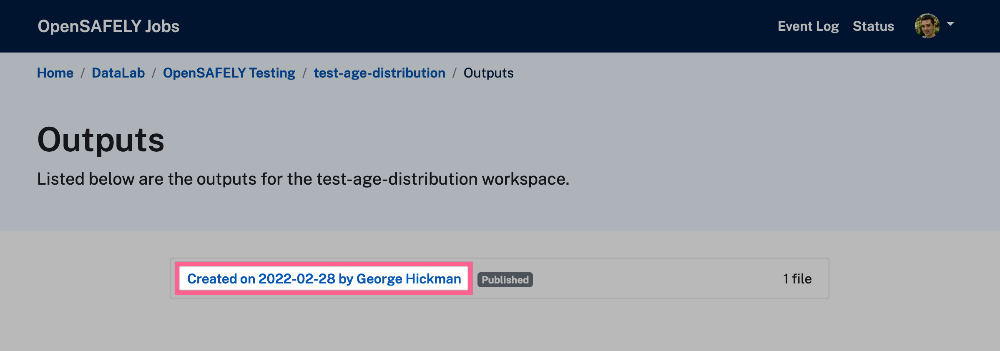
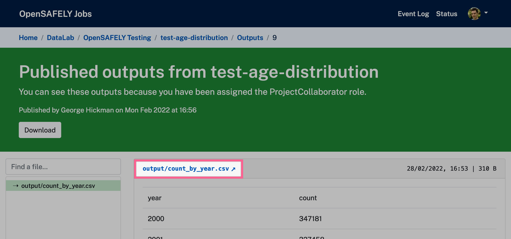

The report you've created so far is only a draft.
Edit your report and complete the steps below to make it available for public viewing.

## Switch to a published outputs
Published reports require the output they're based on to also be published.

Follow [the instructions on publishing your output](../jobs-site.md#publishing-outputs).

Select a set of published outputs from the list:

!!! note
    Published outputs can be in a draft status while they are being reviewed.
    A badge saying "published" will be displayed next to those which have moved out of that state.

Select the file you want to use for your report from the list on the left, and copy the direct URL which shows at the top of the file viewer.

Replace the `Job server url` you currently have with this URL.you will need in the reports admin.

## Create a DOI
All published reports should have a DOI.
You will need your own [CrossRef user credentials](https://www.crossref.org/documentation/member-setup/account-credentials/) in order to register DOIs.

How to create and add a DOI:

1. Make sure your report is published and not still draft. (CrossRef requires that all DOIs link to a landing page which is publicly accessible.)
2. Find the suggested DOI on the admin page for your report.
3. Go to the [CrossRef Web Deposit page](https://apps.crossref.org/webDeposit/) and fill in the basic information:
  - select `Report` as the Data Type.
  - Enter the suggested DOI from your report, prefixed with our organisation code: `10.53764/xxxxxxxxxxxx`.
  - Add the URL for the report.
  - `OpenSAFELY` as Publisher.
  - Authors have to be added one-by-one so you may wish to use `The OpenSAFELY Collaborative` in place of some or all authors, if appropriate.
  - Use the report's first publication date as the `online` publication date (`Print` publication date can be left blank).
4. Submit DOI, you'll then be prompted for your login credentials and then your/an email address.
5. Enter the DOI URL in the `DOI` field (`https://doi.org/10.53764/xxxxxxxxxxxx`)

See the [Crossref documentation](https://www.crossref.org/documentation/member-setup/web-deposit-form/) for more information.

## Publish your report
Untick the `Is draft` check box and click Save.

Your report has now been published and will be visible to the public on the reports site.
