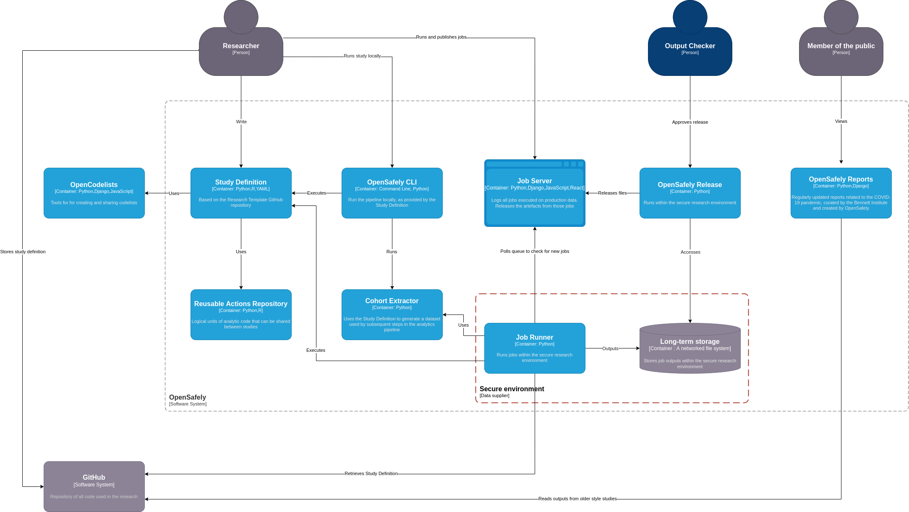

This shows the architecture of OpenSafely. It is intended for a more technical audience.

## System context

How OpenSafely fits into the wider world.

## Container diagram

This shows the high-level technical building blocks of the system.

