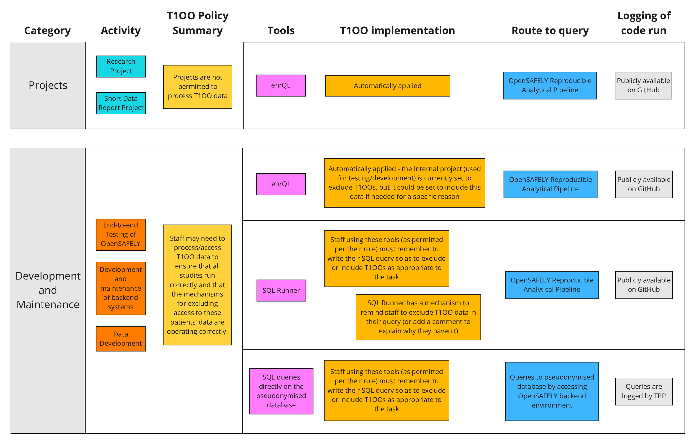

## Background

The OpenSAFELY platform was established during the COVID-19 pandemic; the legal basis the platform originally operated under was for the monitoring and control of communicable disease and other risks to public health.
NHS England policy was that the [Type 1 Opt-Out](https://www.nhs.uk/using-the-nhs/about-the-nhs/opt-out-of-sharing-your-health-records/) was not required to be upheld due to the overriding public interest in responding to the COVID-19 pandemic.
In June 2023, the [legal basis for the operation of the platform](https://digital.nhs.uk/about-nhs-digital/corporate-information-and-documents/directions-and-data-provision-notices/data-provision-notices-dpns/opensafely-covid-19-service-data-provision-notice) changed to powers that traditionally _do_ uphold a Type 1 Opt-out.
Therefore, since June 2023, the OpenSAFELY platform has been required to exclude patients with a Type 1 Opt-out from all projects, except those explicitly described in our [Data Access Policy](data-access-policy.md) and [Data Protection Impact Assessment](https://digital.nhs.uk/about-nhs-digital/corporate-information-and-documents/directions-and-data-provision-notices/data-provision-notices-dpns/opensafely-covid-19-service-data-provision-notice#further-information).

The policy for determining which patients have an active Type 1 Opt-out is agreed by NHS England. This policy has changed over time. See [here](https://www.opensafely.org/changelog/#2024-08-07) and [here](https://www.opensafely.org/changelog/#2024-10-29) for how that has impacted the data made available via OpenSAFELY.

## Technical details

### The list of patients with an active Type 1 Opt-Out

The system suppliers provide a list of pseudonymous IDs for patients for whom there is an active Type 1 opt-out. It is populated by the system supplier according to the policy agreed with NHS England. This list is provided and stored in the secure database along with the rest of the patient data. It consists of a single bespoke table, with a single list of pseudonymous IDs and no other information.
The way this list has been provided has changed over time, to match the changing policy as described [above](#background).

### How is permission to access Type 1 Opt-Out data determined?

The list of projects with continuing type 1 opt-out access has been embedded into the platform's public codebase, rather than being stored in a database.
This is an unusual step from an engineering standpoint, but it means that any changes to the list are automatically included in the public audit log of code changes.
It is also automatically covered by our [code protection rules](https://docs.github.com/en/repositories/configuring-branches-and-merges-in-your-repository/managing-protected-branches/about-protected-branches#require-pull-request-reviews-before-merging) which require independent sign-off by another developer for all code changes.

We have also added an additional code protection rule that changes to the specific files involved require sign-off from the Information Governance team (the [code owners](https://docs.github.com/en/repositories/managing-your-repositorys-settings-and-features/customizing-your-repository/about-code-owners)).

The [project permissions](https://github.com/opensafely-core/job-server/blob/main/jobserver/permissions/t1oo.py) file, the [history of changes](https://github.com/opensafely-core/job-server/commits/main/jobserver/permissions/t1oo.py) to it, and the additional [code protection rules](https://github.com/opensafely-core/job-server/blob/main/.github/CODEOWNERS) are all publicly available on Github.

### How is permission to access Type 1 Opt-Out data enforced?

In OpenSAFELY researchers do not have direct access to the data.
Instead they describe the data they require using [ehrQL](https://docs.opensafely.org/ehrql/), our Electronic Health Record Query Language, and ehrQL is responsible for fetching it.

At the point where ehrQL needs to fetch the data, it is told (by the system described above) whether it should include data from opted-out patients or not.

Every ehrQL query contains a "population definition" which specifies exactly which criteria a patient must meet to be included in the result e.g. "patients between the ages of 18 and 65 who have not recently changed GP practice".
Unless a project is named in the project permissions file, ehrQL will automatically add an extra condition to this population definition: the patient's pseudonymous ID number must not appear in the list of ID numbers [provided by the system supplier](#the-list-of-patients-with-an-active-Type-1-Opt-Out).

Again, the [code which enforces this](https://github.com/opensafely-core/ehrql/blob/72f289b0183e4c5dcbd9cbd6fcfa243a76fb9a67/ehrql/backends/tpp.py#L97-L129) is publicly available on Github.

### Data access which does _not_ go via ehrQL

There are two sorts of circumstances under which data access in OpenSAFELY does not go via ehrQL, each with different behaviour with respect to type 1 opted-out patients' data.

#### 1. SQL Runner

SQL Runner is a tool which allows the user to retrieve data by writing "raw" SQL rather than ehrQL.
It is intended for the data curation and investigation tasks necessary for operating the platform, rather than research purposes.
Its use is therefore limited to just those OpenSAFELY staff involved in this work.
Details of the circumstances under which OpenSAFELY staff may perform development and maintenance activities are described in our [Data Access Policy](https://docs.opensafely.org/data-access-policy/).

This is enforced by a parallel mechanism to that which controls access to type 1 opt out data via ehrQL and any changes to this policy will appear in the public [audit log](https://github.com/opensafely-core/job-server/commits/main/jobserver/permissions/sqlrunner.py).

SQL Runner does not itself grant or deny access to opted-out data.
Instead the user must declare whether the task in question should properly exclude such data or not, and SQL Runner enforces that such a declaration has been made by rejecting any queries which do not explicitly reference the opt-out table.

All SQL Runner code run against patient data is also visible on our public “jobs” server: [https://jobs.opensafely.org/](https://jobs.opensafely.org/); therefore, it will be possible to see which code (or jobs) were run against patients with a type 1 opt-out.

#### 2. Direct access to pseudonymised data

In order to facilitate the operation and maintenance of the OpenSAFELY platform a small number of individuals are able to access the pseudonymised data directly, without going via ehrQL or SQL Runner.
It is important to note that the code run in such circumstances will not be publicly visible on our “jobs” server, but it is logged in the database audit file of the GP system suppliers; preventing access to patient data with a type 1 opt-out is not enforceable at this level.

The circumstances under which this is permitted and the rationale are covered in detail in our [Data Access Policy](https://docs.opensafely.org/data-access-policy/) but, importantly, such access is never used for research purposes.

#### Cohort Extractor is discontinued

ehrQL's predecessor was a tool called "Cohort Extractor". This has now been discontinued and is no longer permitted to be used. Although Cohort Extractor applied exactly the same rules as does ehrQL with respect to opt-outs it was not originally intended to enforce data access controls and its design makes it difficult to implement the same security boundaries as ehrQL.

## Summary Diagram

